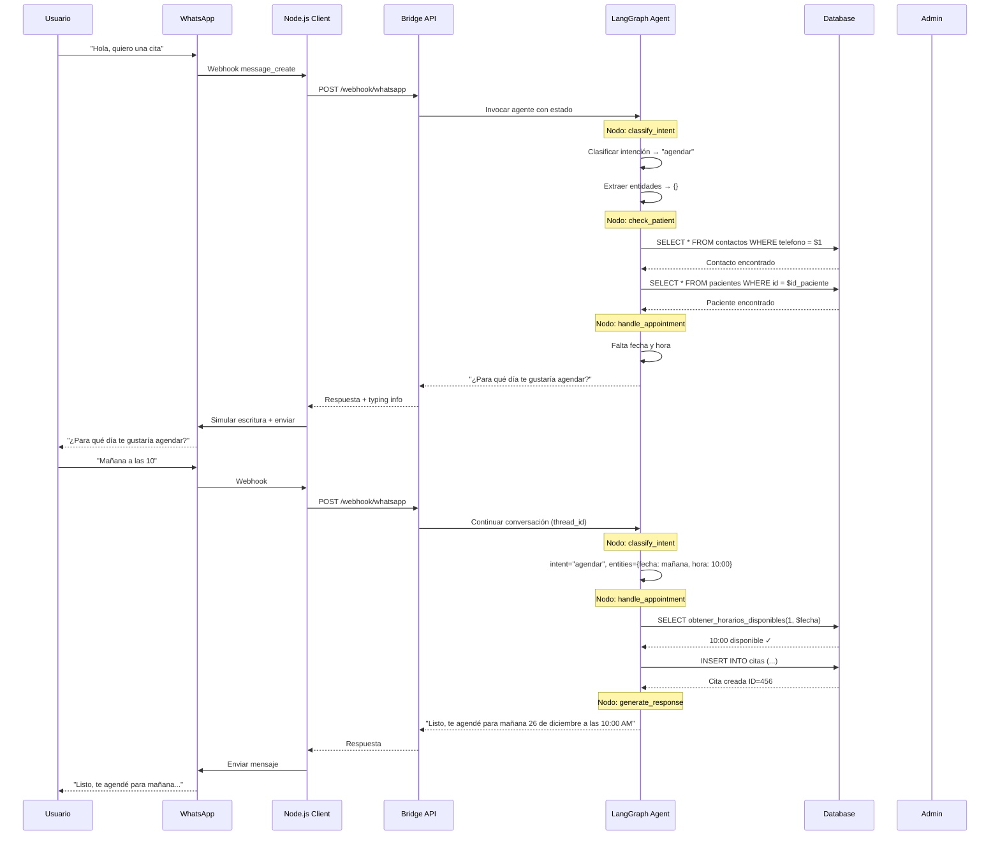
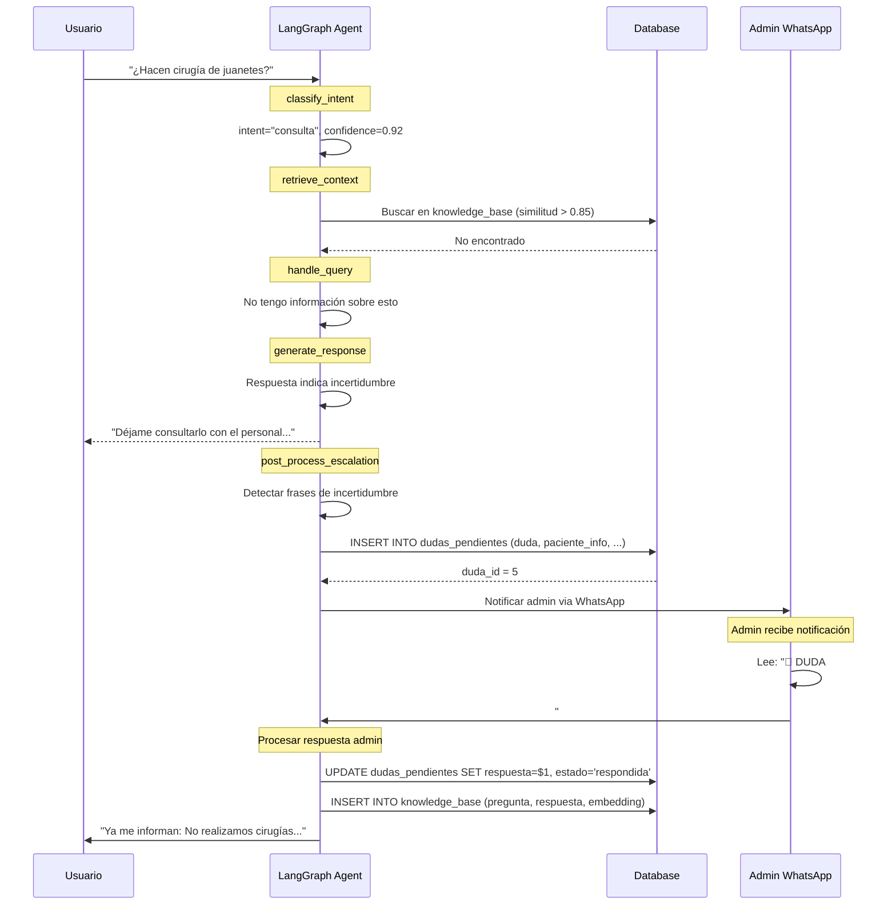
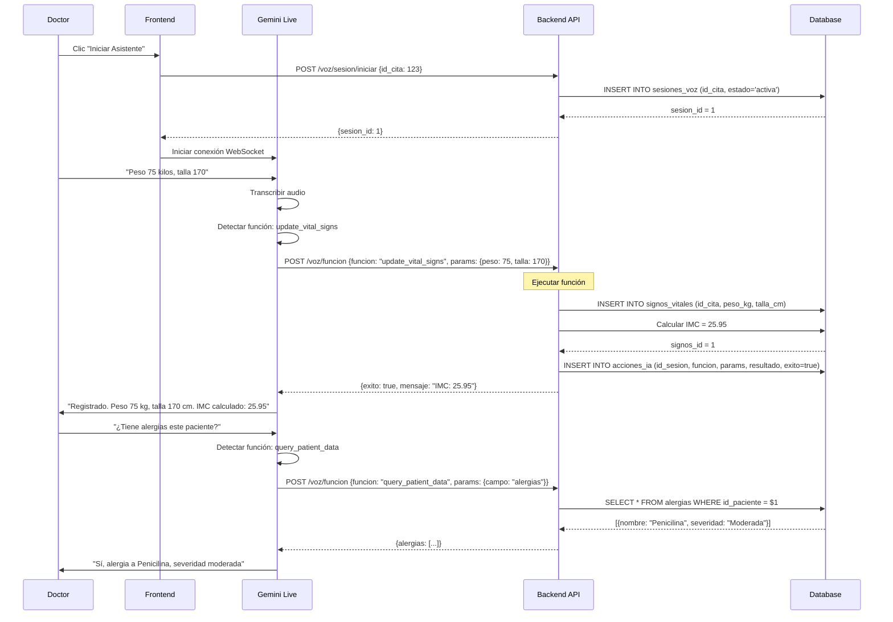

# Functional Specification Document (FSD)

## Podoskin Solution - Manual de Construcción Técnica

---

**Versión**: 1.0  
**Fecha**: 25 de Diciembre, 2024  
**Propósito**: Especificación detallada paso a paso para implementación por agentes de IA

---

## 1. Introducción

### 1.1 Propósito del Documento

Este FSD proporciona especificaciones granulares de cada operación, flujo de datos y comportamiento de componentes. Sirve como manual de construcción para agentes de IA.

### 1.2 Documentación Complementaria

> **⚠️ [AGENTE-7] Implementación de Gemini Live + Orquestador + SubAgentes**
>
> El sistema de asistente de voz usa una **arquitectura híbrida segura** que proporciona:
>
> - Audio bidireccional nativo (16kHz entrada resampleada, 24kHz salida)
> - Function calling con respuestas inmediatas
> - **Sesiones seguras** (API key en backend, tokens efímeros)
> - **Orquestador** para consultas complejas → SubAgentes
>
> **Código de referencia PRINCIPAL**:
>
> - [gemini-live-voice-controller/](file:///c:/Users/Salva/OneDrive/Documentos/Database/gemini-live-voice-controller) - Implementación frontend
> - [recomendacionesLangGraph.md](file:///c:/Users/Salva/OneDrive/Documentos/Database/recomendacionesLangGraph.md) - Patrones LangGraph
>
> **Arquitectura de Seguridad (OBLIGATORIO)**:
>
> 1. **NO exponer API key en cliente**
> 2. Backend endpoints:
>    - `POST /api/live/session/start` → Crea sesión segura
>    - `POST /api/live/session/stop` → Cierra sesión
>    - `POST /api/live/tool/call` → Ejecuta tools críticas
> 3. Tokens efímeros con TTL y revocación
>
> **SubAgentes de Producción** (grafos LangGraph):
>
> | SubAgente | Trigger | Función |
> |-----------|---------|---------|
> | WhatsApp | Mensaje entrante | Chatbot 24/7, escalamiento |
> | Resúmenes | Consulta compleja | Resume consultas/conversaciones |
> | Análisis Clínico | Cron/nueva nota | Evolución, seguimientos |
> | Análisis Financiero | Cron/pago | Reportes, anomalías |
>
> **Patrones LangGraph** (todos los SubAgentes):
>
> - `TypedDict` por SubAgente (estado aislado)
> - `checkpointer` persistente (Redis/Postgres)
> - `interrupt`/`resume` para validación humana
> - `audit_logs` obligatorios
>
> **Funciones médicas**: [GEMINI_LIVE_FUNCTIONS.md](file:///c:/Users/Salva/OneDrive/Documentos/Database/data/GEMINI_LIVE_FUNCTIONS.md)

### 1.3 Convenciones del Documento

- **[AGENTE-X]**: Indica qué agente implementa cada sección
- **→**: Flujo de datos o transición
- **✓**: Paso completado / validación exitosa
- **✗**: Error / validación fallida

---

## 2. Contratos de API - Especificación Completa

### 2.1 [AGENTE-2] Autenticación

#### POST /auth/login

**Request**:

```json
{
  "username": "string (3-50 chars, alphanumeric + _)",
  "password": "string (8-100 chars)"
}
```

**Response 200**:

```json
{
  "access_token": "eyJhbGciOiJIUzI1NiIs...",
  "token_type": "bearer",
  "expires_in": 3600,
  "user": {
    "id": 1,
    "username": "dr.santiago",
    "email": "santiago@podoskin.com",
    "rol": "podologo",
    "nombre_completo": "Dr. Santiago Ornelas"
  }
}
```

**Response 401**:

```json
{
  "detail": "Credenciales incorrectas",
  "error_code": "AUTH_INVALID_CREDENTIALS"
}
```

**Response 429**:

```json
{
  "detail": "Demasiados intentos. Espere 60 segundos",
  "error_code": "RATE_LIMIT_EXCEEDED",
  "retry_after": 60
}
```

**Flujo Interno**:

```
1. Recibir username/password
2. Validar formato de entrada
   ✗ → 422 Validation Error
3. Buscar usuario en BD por username
   ✗ → 401 Credenciales incorrectas
4. Verificar password con bcrypt
   ✗ → 401 Credenciales incorrectas
5. Verificar usuario activo
   ✗ → 403 Usuario inactivo
6. Generar JWT con payload:
   - sub: username
   - rol: rol del usuario
   - exp: now + 3600s
   - iat: now
7. Actualizar ultimo_acceso en BD
8. Retornar token + datos de usuario
```

---

### 2.2 [AGENTE-3] Pacientes

#### GET /pacientes

**Query Parameters**:

| Param | Tipo | Default | Descripción |
|-------|------|---------|-------------|
| page | int | 1 | Página (1-indexed) |
| limit | int | 20 | Items por página (max: 100) |
| search | string | null | Búsqueda por nombre/teléfono |
| activo | bool | true | Filtrar por estado |
| orden | string | "nombre" | Campo de ordenamiento |
| direccion | string | "asc" | asc o desc |

**Response 200**:

```json
{
  "items": [
    {
      "id": 1,
      "nombre_completo": "Juan Pérez García",
      "telefono_principal": "6861234567",
      "email": "juan@email.com",
      "fecha_nacimiento": "1990-05-15",
      "edad": 34,
      "ultima_cita": "2024-12-20T10:00:00",
      "total_citas": 5,
      "activo": true
    }
  ],
  "total": 150,
  "page": 1,
  "limit": 20,
  "pages": 8
}
```

**Flujo Interno**:

```
1. Extraer query params
2. Validar rangos (page >= 1, limit <= 100)
3. Construir query SQL dinámico:
   - Si search: WHERE (nombre ILIKE %search% OR telefono LIKE %search%)
   - Si activo != null: AND activo = $activo
4. Ejecutar COUNT para total
5. Ejecutar SELECT con LIMIT/OFFSET
6. Calcular edad desde fecha_nacimiento
7. Obtener última cita de cada paciente
8. Retornar paginado
```

#### POST /pacientes

**Request**:

```json
{
  "primer_nombre": "string (required, 1-50)",
  "segundo_nombre": "string (optional, max 50)",
  "primer_apellido": "string (required, 1-50)",
  "segundo_apellido": "string (optional, max 50)",
  "fecha_nacimiento": "date (required, format: YYYY-MM-DD)",
  "sexo": "string (required, enum: M|F|O)",
  "curp": "string (optional, regex: ^[A-Z]{4}\\d{6}[HM][A-Z]{5}\\d{2}$)",
  "telefono_principal": "string (required, 10-15 digits)",
  "telefono_secundario": "string (optional)",
  "email": "string (optional, valid email)",
  "calle": "string (optional)",
  "numero_exterior": "string (optional)",
  "numero_interior": "string (optional)",
  "colonia": "string (optional)",
  "ciudad": "string (optional)",
  "estado": "string (optional)",
  "codigo_postal": "string (optional, 5 digits)",
  "ocupacion": "string (optional)",
  "estado_civil": "string (optional)",
  "referencia": "string (optional, max 255)"
}
```

**Validaciones**:

```
1. primer_nombre: required, min 1 char
2. fecha_nacimiento: no puede ser futura
3. curp: si presente, validar formato y unicidad
4. telefono_principal: solo dígitos, 10-15 chars
5. email: si presente, validar formato
```

**Response 201**:

```json
{
  "id": 42,
  "nombre_completo": "Juan Pérez García",
  ...todos los campos...
  "fecha_registro": "2024-12-25T10:30:00"
}
```

---

### 2.3 [AGENTE-3] Alergias

#### GET /pacientes/{id}/alergias

**Response 200**:

```json
{
  "items": [
    {
      "id": 1,
      "tipo": "Medicamento",
      "nombre": "Penicilina",
      "reaccion": "Rash cutáneo",
      "severidad": "Moderada",
      "fecha_diagnostico": "2020-03-15",
      "activo": true
    }
  ],
  "total": 2
}
```

#### POST /pacientes/{id}/alergias

**Request**:

```json
{
  "tipo": "string (enum: Medicamento|Alimento|Ambiental|Material|Otro)",
  "nombre": "string (required, 1-100)",
  "reaccion": "string (optional)",
  "severidad": "string (enum: Leve|Moderada|Grave|Mortal)",
  "fecha_diagnostico": "date (optional)",
  "notas": "string (optional)"
}
```

---

### 2.4 [AGENTE-4] Citas

#### GET /citas/disponibilidad

**Query Parameters**:

| Param | Tipo | Requerido | Descripción |
|-------|------|-----------|-------------|
| id_podologo | int | Sí | ID del podólogo |
| fecha | date | Sí | Fecha a consultar |

**Response 200**:

```json
{
  "fecha": "2024-12-26",
  "podologo": {
    "id": 1,
    "nombre": "Dr. Santiago Ornelas"
  },
  "slots": [
    { "hora": "09:00", "disponible": true },
    { "hora": "09:30", "disponible": true },
    { "hora": "10:00", "disponible": false, "motivo": "Cita agendada" },
    { "hora": "10:30", "disponible": true },
    ...
  ]
}
```

**Flujo Interno**:

```
1. Validar id_podologo existe
2. Validar fecha >= hoy
3. Obtener horario de trabajo del podólogo para ese día
   - Consultar tabla horarios_trabajo
   - Verificar no sea día bloqueado
4. Generar slots cada 30 minutos
5. Para cada slot:
   a. Verificar si hay cita existente
   b. Si hay cita con estado != Cancelada/No_Asistio → no disponible
6. Retornar array de slots con disponibilidad
```

#### POST /citas

**Request**:

```json
{
  "id_paciente": "int (required)",
  "id_podologo": "int (required)",
  "fecha_hora_inicio": "datetime (required, format: YYYY-MM-DDTHH:mm:ss)",
  "tipo_cita": "string (enum: Consulta|Seguimiento|Urgencia)",
  "motivo_consulta": "string (optional)",
  "notas_recepcion": "string (optional)"
}
```

**Validaciones**:

```
1. id_paciente existe y está activo
2. id_podologo existe y está activo
3. fecha_hora_inicio >= ahora + 1 hora
4. Slot está disponible (no hay conflicto)
5. No hay otra cita del mismo paciente el mismo día
```

**Response 201**:

```json
{
  "id": 123,
  "id_paciente": 42,
  "id_podologo": 1,
  "fecha_hora_inicio": "2024-12-26T10:00:00",
  "fecha_hora_fin": "2024-12-26T10:30:00",
  "tipo_cita": "Consulta",
  "estado": "Confirmada",
  "es_primera_vez": true,
  "paciente": {
    "id": 42,
    "nombre_completo": "Juan Pérez"
  }
}
```

**Flujo Interno**:

```
1. Validar todos los campos
2. Verificar disponibilidad del slot
   ✗ → 409 Conflicto de horario
3. Calcular fecha_hora_fin = inicio + 30 min
4. Determinar es_primera_vez:
   SELECT COUNT(*) FROM citas WHERE id_paciente = $1 AND estado = 'Completada'
   Si count == 0 → es_primera_vez = true
5. INSERT en tabla citas
6. Programar recordatorios:
   - Crear job para 24h antes
   - Crear job para 2h antes
7. Retornar cita creada con datos del paciente
```

---

### 2.5 [AGENTE-5] Signos Vitales

#### POST /citas/{id}/signos-vitales

**Request**:

```json
{
  "peso_kg": "decimal (optional, 0.1-500)",
  "talla_cm": "decimal (optional, 30-250)",
  "presion_sistolica": "int (optional, 60-250)",
  "presion_diastolica": "int (optional, 40-150)",
  "frecuencia_cardiaca": "int (optional, 30-200)",
  "frecuencia_respiratoria": "int (optional, 8-60)",
  "temperatura_celsius": "decimal (optional, 34-42)",
  "saturacion_oxigeno": "int (optional, 70-100)",
  "glucosa_capilar": "int (optional, 30-600)"
}
```

**Response 201**:

```json
{
  "id": 1,
  "id_cita": 123,
  "peso_kg": 75.5,
  "talla_cm": 170,
  "imc": 26.12,
  "imc_clasificacion": "Sobrepeso",
  "presion_arterial": "120/80",
  "frecuencia_cardiaca": 72,
  "fecha_medicion": "2024-12-26T10:05:00"
}
```

**Cálculos Automáticos**:

```python
# IMC
if peso_kg and talla_cm:
    imc = peso_kg / ((talla_cm / 100) ** 2)
    
    # Clasificación
    if imc < 18.5:
        clasificacion = "Bajo peso"
    elif imc < 25:
        clasificacion = "Normal"
    elif imc < 30:
        clasificacion = "Sobrepeso"
    else:
        clasificacion = "Obesidad"
```

---

### 2.6 [AGENTE-5] Diagnósticos

#### POST /citas/{id}/diagnosticos

**Request**:

```json
{
  "tipo": "string (enum: Presuntivo|Definitivo|Diferencial)",
  "descripcion": "string (required, 1-500)",
  "codigo_cie10": "string (optional, format: [A-Z]\\d{2}(\\.\\d{1,2})?)",
  "notas": "string (optional)"
}
```

**Response 201**:

```json
{
  "id": 1,
  "id_cita": 123,
  "tipo": "Definitivo",
  "descripcion": "Fascitis plantar bilateral",
  "codigo_cie10": "M72.2",
  "codigo_cie10_descripcion": "Fibromatosis de la aponeurosis plantar",
  "diagnosticado_por": {
    "id": 1,
    "nombre": "Dr. Santiago Ornelas"
  },
  "fecha_diagnostico": "2024-12-26T10:15:00"
}
```

---

## 3. Flujos de Usuario Detallados

### 3.1 [AGENTE-6] Flujo Completo de Chatbot WhatsApp



### 3.2 [AGENTE-6] Flujo de Escalamiento de Dudas



### 3.3 [AGENTE-7] Flujo de Asistente de Voz



---

## 4. Comportamiento de Componentes Frontend

### 4.1 [AGENTE-9] Componente: FormularioPaciente

**Props**:

```typescript
interface FormularioPacienteProps {
  pacienteId?: number;          // undefined = crear, number = editar
  modo: 'guiado' | 'libre';
  onGuardar: (paciente: Paciente) => void;
  onCancelar: () => void;
}
```

**Estado Interno**:

```typescript
interface FormState {
  formData: Partial<Paciente>;
  seccionActual: number;          // Solo para modo guiado
  seccionesCompletadas: Set<string>;
  errores: Record<string, string>;
  isDirty: boolean;
  isSubmitting: boolean;
  ultimoGuardado: Date | null;
}
```

**Comportamiento**:

```
INICIALIZACIÓN:
1. Si pacienteId presente:
   - Llamar GET /pacientes/{id}
   - Popular formData con respuesta
   - Marcar secciones completadas según datos existentes
2. Si no hay pacienteId:
   - Inicializar formData vacío
   - seccionActual = 0

MODO GUIADO:
- Mostrar una sección a la vez
- Botón "Siguiente" valida sección actual
  ✓ → Marcar completada, avanzar a siguiente
  ✗ → Mostrar errores, no avanzar
- Botón "Anterior" permite retroceder
- Barra de progreso: (seccionesCompletadas.size / totalSecciones) * 100

MODO LIBRE:
- Mostrar todas las secciones como acordeones
- Usuario puede llenar en cualquier orden
- Validar al intentar guardar

AUTO-GUARDADO (cada 30 segundos):
1. Si isDirty && !isSubmitting:
2. Llamar PUT /pacientes/{id} (si existe) o guardar en localStorage
3. Actualizar ultimoGuardado
4. isDirty = false

VALIDACIÓN POR CAMPO:
- primer_nombre: required, min 1, max 50
- fecha_nacimiento: required, <= hoy
- telefono_principal: required, regex /^\d{10,15}$/
- email: optional, regex email
- curp: optional, regex CURP mexicano
```

**Secciones del Formulario**:

```typescript
const SECCIONES = [
  {
    id: 'identificacion',
    titulo: 'Ficha de Identificación',
    campos: ['primer_nombre', 'segundo_nombre', 'primer_apellido', ...]
  },
  {
    id: 'contacto',
    titulo: 'Información de Contacto',
    campos: ['telefono_principal', 'telefono_secundario', 'email']
  },
  {
    id: 'domicilio',
    titulo: 'Domicilio',
    campos: ['calle', 'numero_exterior', ...]
  },
  {
    id: 'alergias',
    titulo: 'Alergias',
    tipo: 'lista_dinamica'
  },
  {
    id: 'antecedentes',
    titulo: 'Antecedentes Médicos',
    subsecciones: ['heredofamiliares', 'patologicos', 'quirurgicos', 'traumaticos']
  },
  {
    id: 'estilo_vida',
    titulo: 'Estilo de Vida',
    campos: ['dieta', 'ejercicio', 'tabaquismo', ...]
  }
];
```

---

### 4.2 [AGENTE-10] Componente: CalendarioCitas

**Props**:

```typescript
interface CalendarioCitasProps {
  idPodologo: number;
  fechaInicial?: Date;
  onSeleccionarSlot: (slot: SlotDisponible) => void;
  onSeleccionarCita: (cita: Cita) => void;
}
```

**Estado**:

```typescript
interface CalendarioState {
  fechaActual: Date;
  vista: 'dia' | 'semana' | 'mes';
  citas: Cita[];
  slotsDisponibles: SlotDisponible[];
  loading: boolean;
}
```

**Comportamiento**:

```
AL MONTAR / CAMBIAR FECHA:
1. Calcular rango de fechas según vista:
   - dia: solo fechaActual
   - semana: lunes a domingo de la semana
   - mes: día 1 al último del mes
2. Llamar GET /citas?id_podologo={id}&fecha_inicio={}&fecha_fin={}
3. Para cada día en el rango:
   - Llamar GET /citas/disponibilidad?id_podologo={id}&fecha={dia}
4. Popular citas[] y slotsDisponibles[]

RENDERIZADO:
- Mostrar grilla de tiempo (filas) x días (columnas)
- Citas existentes: bloques coloreados según estado
  - Confirmada: azul
  - En_Curso: verde
  - Completada: gris
  - Cancelada: rojo tachado
- Slots disponibles: espacios clickeables

INTERACCIÓN:
- Click en slot disponible → onSeleccionarSlot(slot)
- Click en cita existente → onSeleccionarCita(cita)
- Click en navegación (< >) → cambiar fechaActual
- Click en selector de vista → cambiar vista
```

---

## 5. Lógica de Negocio - Funciones Críticas

### 5.1 [AGENTE-1] Función: obtener_horarios_disponibles

```sql
CREATE OR REPLACE FUNCTION obtener_horarios_disponibles(
    p_id_podologo INTEGER,
    p_fecha DATE
) RETURNS TABLE (
    hora_slot TIME,
    disponible BOOLEAN,
    motivo TEXT
) AS $$
DECLARE
    v_hora_inicio TIME;
    v_hora_fin TIME;
    v_dia_semana INTEGER;
BEGIN
    v_dia_semana := EXTRACT(DOW FROM p_fecha);
    
    -- Obtener horario del día
    SELECT hora_inicio, hora_fin
    INTO v_hora_inicio, v_hora_fin
    FROM horarios_trabajo
    WHERE id_podologo = p_id_podologo
      AND dia_semana = v_dia_semana
      AND activo = true;
    
    -- Si no hay horario, retornar vacío
    IF v_hora_inicio IS NULL THEN
        RETURN;
    END IF;
    
    -- Verificar bloqueos
    IF EXISTS (
        SELECT 1 FROM bloqueos_agenda
        WHERE id_podologo = p_id_podologo
          AND p_fecha BETWEEN fecha_inicio AND fecha_fin
    ) THEN
        RETURN;
    END IF;
    
    -- Generar slots
    RETURN QUERY
    WITH slots AS (
        SELECT generate_series(v_hora_inicio, v_hora_fin - INTERVAL '30 minutes', '30 minutes'::INTERVAL)::TIME as hora
    ),
    citas_ocupadas AS (
        SELECT 
            fecha_hora_inicio::TIME as hora_inicio,
            fecha_hora_fin::TIME as hora_fin
        FROM citas
        WHERE id_podologo = p_id_podologo
          AND fecha_hora_inicio::DATE = p_fecha
          AND estado NOT IN ('Cancelada', 'No_Asistio')
    )
    SELECT 
        s.hora,
        NOT EXISTS (
            SELECT 1 FROM citas_ocupadas c
            WHERE s.hora >= c.hora_inicio AND s.hora < c.hora_fin
        ) as disponible,
        CASE 
            WHEN EXISTS (
                SELECT 1 FROM citas_ocupadas c
                WHERE s.hora >= c.hora_inicio AND s.hora < c.hora_fin
            ) THEN 'Cita agendada'
            ELSE NULL
        END as motivo
    FROM slots s
    ORDER BY s.hora;
END;
$$ LANGUAGE plpgsql;
```

### 5.2 [AGENTE-6] Función: search_knowledge_base

```python
async def search_knowledge_base(
    query: str,
    threshold: float = 0.85,
    limit: int = 5
) -> List[KnowledgeEntry]:
    """
    Busca en la base de conocimiento usando similitud semántica.
    
    Pasos:
    1. Generar embedding de la consulta
    2. Buscar entradas similares en BD
    3. Filtrar por threshold
    4. Incrementar contador si hay match
    5. Retornar resultados ordenados por similitud
    """
    
    # 1. Generar embedding
    embedding_service = EmbeddingService()
    query_embedding = embedding_service.encode_single(query)
    query_bytes = embedding_service.serialize(query_embedding)
    
    # 2. Buscar similares
    async with get_db() as db:
        results = await db.fetch("""
            WITH similares AS (
                SELECT 
                    id,
                    pregunta,
                    respuesta,
                    categoria,
                    veces_consultada,
                    1 - (pregunta_embedding <-> $1) as similarity
                FROM knowledge_base
                WHERE pregunta_embedding IS NOT NULL
            )
            SELECT * FROM similares
            WHERE similarity >= $2
            ORDER BY similarity DESC
            LIMIT $3
        """, query_bytes, threshold, limit)
        
        # 4. Incrementar contador del mejor match
        if results:
            await db.execute("""
                UPDATE knowledge_base
                SET veces_consultada = veces_consultada + 1,
                    fecha_actualizacion = NOW()
                WHERE id = $1
            """, results[0]['id'])
        
        return [KnowledgeEntry(**row) for row in results]
```

### 5.3 [AGENTE-6] Función: escalate_question

```python
async def escalate_question(
    chat_id: str,
    paciente_nombre: str,
    paciente_telefono: str,
    pregunta: str,
    contexto: str = None
) -> int:
    """
    Escala una pregunta al administrador.
    
    Retorna: ID de la duda creada
    """
    
    async with get_db() as db:
        # 1. Crear registro de duda
        result = await db.fetchrow("""
            INSERT INTO dudas_pendientes (
                paciente_chat_id,
                paciente_nombre,
                paciente_telefono,
                duda,
                contexto,
                estado,
                fecha_expiracion
            ) VALUES ($1, $2, $3, $4, $5, 'pendiente', NOW() + INTERVAL '24 hours')
            RETURNING id
        """, chat_id, paciente_nombre, paciente_telefono, pregunta, contexto)
        
        duda_id = result['id']
        
        # 2. Formatear mensaje para admin
        mensaje_admin = f"""🔔 *DUDA DE PACIENTE*

👤 *Paciente*: {paciente_nombre}
📞 *Tel*: {paciente_telefono}
❓ *Pregunta*: {pregunta}

Para responder, escribe:
`#RESPUESTA_{duda_id}`
[Tu respuesta aquí]"""
        
        # 3. Notificar al admin
        admin_chat_id = config.admin_chat_id
        await send_whatsapp_message(admin_chat_id, mensaje_admin)
        
        logger.info(f"Duda #{duda_id} escalada al admin")
        
        return duda_id
```

---

## 6. Manejo de Errores

### 6.1 Códigos de Error Estándar

| Código HTTP | Error Code | Descripción |
|-------------|------------|-------------|
| 400 | VALIDATION_ERROR | Datos de entrada inválidos |
| 401 | AUTH_INVALID_CREDENTIALS | Credenciales incorrectas |
| 401 | AUTH_TOKEN_EXPIRED | Token JWT expirado |
| 403 | AUTH_FORBIDDEN | Sin permisos para esta acción |
| 404 | RESOURCE_NOT_FOUND | Recurso no encontrado |
| 409 | CONFLICT_SCHEDULE | Conflicto de horario |
| 409 | CONFLICT_DUPLICATE | Registro duplicado |
| 422 | UNPROCESSABLE_ENTITY | Entidad no procesable |
| 429 | RATE_LIMIT_EXCEEDED | Límite de requests excedido |
| 500 | INTERNAL_ERROR | Error interno del servidor |

### 6.2 Estructura de Respuesta de Error

```json
{
  "detail": "Mensaje legible para humanos",
  "error_code": "CODIGO_DE_ERROR",
  "errors": [
    {
      "field": "nombre_del_campo",
      "message": "Descripción del error",
      "code": "validation_error_type"
    }
  ],
  "timestamp": "2024-12-25T10:30:00Z",
  "request_id": "uuid-del-request"
}
```

---

## 7. Índice de Implementación por Agente

### Agente 1: Database Setup

- Sección 5.1: Funciones SQL

### Agente 2: Backend Auth

- Sección 2.1: POST /auth/login

### Agente 3: Backend Pacientes

- Sección 2.2: GET/POST /pacientes
- Sección 2.3: GET/POST /pacientes/{id}/alergias

### Agente 4: Backend Citas

- Sección 2.4: GET /citas/disponibilidad, POST /citas

### Agente 5: Backend Tratamientos

- Sección 2.5: POST /citas/{id}/signos-vitales
- Sección 2.6: POST /citas/{id}/diagnosticos

### Agente 6: LangGraph WhatsApp

- Sección 3.1: Flujo Chatbot
- Sección 3.2: Flujo Escalamiento
- Sección 5.2: search_knowledge_base
- Sección 5.3: escalate_question

### Agente 7: Gemini Live

- Sección 3.3: Flujo Asistente Voz

### Agente 9: Frontend Pacientes

- Sección 4.1: FormularioPaciente

### Agente 10: Frontend Citas

- Sección 4.2: CalendarioCitas

---

**Fin del FSD**
