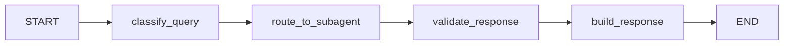

# Agente Padre Orquestador

Agente principal que coordina y valida SubAgentes para consultas complejas en Podoskin Solution.

## Propósito

El Orquestador actúa como router inteligente que:
- **Clasifica** consultas como simples o complejas
- **Delega** consultas complejas a SubAgentes especializados
- **Valida** respuestas antes de retornarlas
- **Audita** todas las operaciones

## Arquitectura

```
Gemini Live Frontend
    ↓
Orquestador
    ├─→ Consultas SIMPLES → Respuesta directa
    └─→ Consultas COMPLEJAS → SubAgentes
        ├─→ SubAgente Resúmenes
        ├─→ SubAgente WhatsApp
        └─→ SubAgente Análisis
```

## Flujo del Grafo



### Nodos

1. **classify_query** - Determina si es simple o compleja
2. **route_to_subagent** - Delega a SubAgente (si necesario)
3. **validate_response** - Valida respuesta del SubAgente
4. **build_response** - Construye respuesta final

## Configuración

### Funciones Simples (Directo)

Estas funciones NO pasan por el orquestador:
- `update_vital_signs`
- `create_clinical_note`
- `query_patient_data`
- `add_allergy`
- `navigate_to_section`
- `schedule_followup`

### Funciones Complejas (Orquestador → SubAgente)

```python
COMPLEX_FUNCTIONS_MAPPING = {
    "search_patient_history": {
        "subagent": "summaries",
        "requires_context": True,
        "requires_validation": True
    },
    "generate_summary": {
        "subagent": "summaries",
        "requires_context": True,
        "requires_validation": True
    }
}
```

## Uso

### API Endpoint

```bash
POST /api/orchestrator/execute
```

```json
{
  "function_name": "generate_summary",
  "args": {
    "tipo_resumen": "consulta_actual",
    "formato": "breve"
  },
  "context": {
    "patient_id": "123",
    "appointment_id": "456",
    "user_id": "789"
  }
}
```

### Respuesta

```json
{
  "data": {
    "content": "## Resumen de Consulta\n...",
    "sections": {...}
  },
  "message": "Resumen generado exitosamente",
  "status": "success",
  "execution_time_ms": 1250,
  "messages": ["Clasificando...", "Delegando...", ...],
  "audit_log": [...]
}
```

### Uso Directo en Python

```python
from backend.agents.orchestrator import execute_orchestrator

result = await execute_orchestrator(
    function_name="generate_summary",
    args={
        "tipo_resumen": "consulta_actual",
        "formato": "breve"
    },
    patient_id="123",
    user_id="789",
    appointment_id="456"
)

print(result["message"])
print(result["data"])
```

## SubAgentes Disponibles

### 1. SubAgente Resúmenes

- **Trigger**: `generate_summary`, `search_patient_history`
- **Función**: Genera resúmenes y búsqueda semántica
- **Path**: `backend.agents.summaries.graph`

### 2. SubAgente WhatsApp

- **Trigger**: Mensaje entrante
- **Función**: Chatbot 24/7, escalamiento
- **Path**: `backend.agents.sub_agent_whatsApp.graph`

### 3. SubAgente Análisis (Pendiente)

- **Trigger**: Cron/nueva nota
- **Función**: Análisis clínico y evolución
- **Path**: `backend.agents.analysis.graph`

## Validaciones

El orquestador aplica reglas de validación específicas por función:

```python
VALIDATION_RULES = {
    "generate_summary": {
        "min_length": 50,
        "max_length": 5000,
        "required_sections": ["fecha", "paciente"],
        "forbidden_keywords": ["password", "api_key"]
    }
}
```

## Auditoría

Todas las operaciones se registran en `audit_log`:

```python
{
    "step": "route_to_subagent",
    "timestamp": "2024-12-28T10:30:00",
    "target_subagent": "summaries",
    "success": True
}
```

## Estado

### OrchestratorState (TypedDict)

```python
{
    "function_name": str,
    "args": dict,
    "patient_id": str,
    "query_type": "simple" | "complex",
    "target_subagent": str | None,
    "subagent_response": dict | None,
    "response_data": dict,
    "response_message": str,
    "response_status": "success" | "error",
    "validation_passed": bool,
    "messages": list,
    "audit_log": list
}
```

## Checkpointer

Persistencia de estado para reanudar ejecuciones:

```python
# En config.py
CHECKPOINTER_TYPE = "memory"  # o "postgres", "redis"
```

## LangSmith Tracing

Habilitar trazado para debugging:

```bash
export LANGSMITH_TRACING=true
export LANGSMITH_API_KEY=your_key
export LANGSMITH_PROJECT=podoskin-orchestrator
```

## Testing

```python
# test_orchestrator.py
import pytest
from backend.agents.orchestrator import execute_orchestrator

@pytest.mark.asyncio
async def test_simple_function():
    result = await execute_orchestrator(
        function_name="query_patient_data",
        args={"tipo_consulta": "alergias"},
        patient_id="123",
        user_id="789"
    )
    assert result["status"] == "success"

@pytest.mark.asyncio
async def test_complex_function():
    result = await execute_orchestrator(
        function_name="generate_summary",
        args={"tipo_resumen": "consulta_actual"},
        patient_id="123",
        user_id="789"
    )
    assert result["status"] == "success"
    assert "content" in result["data"]
```

## Agregar Nuevo SubAgente

1. Crear directorio: `backend/agents/my_subagent/`
2. Implementar: `graph.py`, `state.py`, `nodes/`, `config.py`
3. Registrar en `orchestrator/config.py`:

```python
SUBAGENTS_CONFIG["my_subagent"] = {
    "name": "Mi SubAgente",
    "enabled": True,
    "graph_path": "backend.agents.my_subagent.graph",
    "timeout_seconds": 30,
    "max_retries": 2
}
```

4. Mapear función en `COMPLEX_FUNCTIONS_MAPPING`

## Variables de Entorno

```bash
# LLM
ORCHESTRATOR_LLM_MODEL=claude-3-5-haiku-20241022
ORCHESTRATOR_LLM_TEMPERATURE=0.3

# Database
DATABASE_URL=postgresql://localhost/podoskin

# Timeouts
ORCHESTRATOR_TIMEOUT=45
SUBAGENT_TIMEOUT=30

# Checkpointer
CHECKPOINTER_TYPE=memory
CHECKPOINTER_URL=postgresql://localhost/podoskin

# LangSmith
LANGSMITH_TRACING=false
LANGSMITH_API_KEY=
LANGSMITH_PROJECT=podoskin-orchestrator
```

## Referencias

- [LangGraph Documentation](https://langchain-ai.github.io/langgraph/)
- [FSD Podoskin](../../../FSD_Podoskin_Solution.md) - Sección 3.3
- [recomendacionesLangGraph.md](../../../recomendacionesLangGraph.md)
- [SubAgente Resúmenes](../summaries/README.md)
