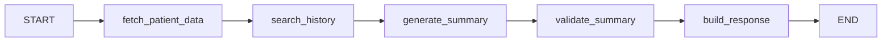

# SubAgente de Resúmenes

SubAgente especializado en generar resúmenes médicos y búsqueda semántica en historial de pacientes.

## Propósito

El SubAgente de Resúmenes:
- **Genera** resúmenes de consultas actuales
- **Analiza** evolución de tratamientos
- **Compila** historiales completos
- **Busca** semánticamente en historial del paciente

## Funciones Que Maneja

### 1. generate_summary

Genera resúmenes estructurados en 3 formatos:

```python
{
    "tipo_resumen": "consulta_actual" | "evolucion_tratamiento" | "historial_completo",
    "formato": "breve" | "detallado" | "para_paciente"
}
```

### 2. search_patient_history

Búsqueda semántica en historial:

```python
{
    "query": "tratamientos para hongos en uñas",
    "limite_resultados": 5
}
```

## Flujo del Grafo



### Nodos

1. **fetch_patient_data** - Obtiene datos del paciente de DB
2. **search_history** - Búsqueda semántica (si aplica)
3. **generate_summary** - Genera resumen con LLM
4. **validate_summary** - Valida calidad del resumen
5. **build_response** - Construye respuesta final

## Templates de Resúmenes

### Consulta Actual - Breve

```markdown
## Resumen de Consulta

**Fecha:** {fecha}
**Paciente:** {paciente}
**Motivo:** {motivo_consulta}

**Hallazgos:**
{hallazgos}

**Plan:**
{plan_tratamiento}
```

### Consulta Actual - Detallado

```markdown
## RESUMEN DETALLADO DE CONSULTA

**Información General**
- Fecha: {fecha}
- Paciente: {paciente}
- Edad: {edad} años

**Signos Vitales**
{signos_vitales}

**Diagnóstico**
- Presuntivo: {diagnostico_presuntivo}
- Definitivo: {diagnostico_definitivo}

**Plan de Tratamiento**
{plan_tratamiento}
```

### Para Paciente

```markdown
## Su Consulta de Hoy

Estimado(a) {paciente},

**¿Por qué vino?**
{motivo_consulta}

**¿Qué encontramos?**
{diagnostico_simple}

**¿Qué debe hacer?**
{indicaciones_paciente}
```

## Uso

### Desde Orquestador (Recomendado)

```python
from backend.agents.orchestrator import execute_orchestrator

result = await execute_orchestrator(
    function_name="generate_summary",
    args={
        "tipo_resumen": "consulta_actual",
        "formato": "breve"
    },
    patient_id="123",
    user_id="789",
    appointment_id="456"
)
```

### Uso Directo

```python
from backend.agents.summaries import execute_summaries

result = await execute_summaries(
    function_name="generate_summary",
    args={
        "tipo_resumen": "evolucion_tratamiento",
        "formato": "detallado"
    },
    patient_id="123",
    user_id="789"
)

print(result["data"]["content"])
```

### Búsqueda Semántica

```python
result = await execute_summaries(
    function_name="search_patient_history",
    args={
        "query": "tratamientos para fascitis plantar",
        "limite_resultados": 10
    },
    patient_id="123",
    user_id="789"
)

for resultado in result["data"]["results"]:
    print(f"{resultado['fecha']}: {resultado['contenido']}")
```

## Estado

### SummaryState (TypedDict)

```python
{
    "function_name": str,
    "args": dict,
    "patient_id": str,
    "summary_type": "consulta_actual" | "evolucion_tratamiento" | "historial_completo",
    "summary_format": "breve" | "detallado" | "para_paciente",
    "patient_data": dict,
    "clinical_notes": list,
    "search_query": str | None,
    "search_results": list | None,
    "summary_content": str,
    "validation_passed": bool,
    "response_data": dict,
    "messages": list,
    "audit_log": list
}
```

## Validaciones

```python
# Longitud
MIN_SUMMARY_LENGTH = 50
MAX_SUMMARY_LENGTH = 5000

# Contenido
- No vacío
- Sin datos sensibles (password, api_key, token)
- Formato correcto según template
```

## Configuración

### LLM

```bash
SUMMARIES_LLM_MODEL=claude-3-5-haiku-20241022
SUMMARIES_LLM_TEMPERATURE=0.5
SUMMARIES_LLM_MAX_TOKENS=3000
```

### Búsqueda Semántica

```bash
SEMANTIC_SEARCH_ENABLED=true
EMBEDDING_MODEL=all-MiniLM-L6-v2
SEARCH_THRESHOLD=0.7
```

### Checkpointer

```bash
SUMMARIES_CHECKPOINTER=memory
```

## Integración con Base de Datos

### Queries Necesarias

El SubAgente necesita acceso a:

```sql
-- Datos del paciente
SELECT * FROM pacientes WHERE id = $1;

-- Citas y notas clínicas
SELECT * FROM citas 
JOIN notas_clinicas ON citas.id = notas_clinicas.id_cita
WHERE citas.id_paciente = $1
ORDER BY fecha_hora_inicio DESC;

-- Tratamientos
SELECT * FROM tratamientos
WHERE id_paciente = $1
ORDER BY fecha_inicio DESC;

-- Signos vitales
SELECT * FROM signos_vitales
WHERE id_cita IN (
    SELECT id FROM citas WHERE id_paciente = $1
)
ORDER BY fecha_medicion DESC;
```

### Búsqueda Semántica

Para `search_patient_history`, implementar:

```python
# tools/search.py
from sentence_transformers import SentenceTransformer
import pgvector

model = SentenceTransformer('all-MiniLM-L6-v2')

async def semantic_search(query: str, patient_id: str, limit: int = 5):
    # Generate query embedding
    query_embedding = model.encode(query)
    
    # Search in pgvector
    results = await db.execute("""
        SELECT contenido, fecha, tipo, 
               1 - (embedding <=> $1::vector) as similarity
        FROM historial_embeddings
        WHERE patient_id = $2
        ORDER BY embedding <=> $1::vector
        LIMIT $3
    """, query_embedding, patient_id, limit)
    
    return results
```

## Ejemplos de Respuesta

### generate_summary (consulta_actual, breve)

```json
{
  "data": {
    "content": "## Resumen de Consulta\n\n**Fecha:** 2024-12-20\n**Paciente:** Juan Pérez\n**Motivo:** Dolor en talón derecho\n\n**Hallazgos:**\nDolor a la palpación de fascia plantar\n\n**Plan:**\nPlantillas ortopédicas, antiinflamatorios",
    "sections": {
      "tipo": "consulta_actual",
      "formato": "breve"
    },
    "metadata": {
      "patient_id": "123",
      "function_name": "generate_summary"
    }
  },
  "message": "Resumen generado exitosamente",
  "status": "success",
  "execution_time_ms": 850
}
```

### search_patient_history

```json
{
  "data": {
    "results": [
      {
        "fecha": "2024-11-15",
        "tipo": "nota_clinica",
        "contenido": "Tratamiento para onicomicosis en uña del pie derecho",
        "relevancia": 0.85
      },
      {
        "fecha": "2024-09-20",
        "tipo": "tratamiento",
        "contenido": "Aplicación de láser para hongos en uñas",
        "relevancia": 0.78
      }
    ],
    "total": 2
  },
  "message": "Encontrados 2 resultados",
  "status": "success"
}
```

## Testing

```python
# test_summaries.py
import pytest
from backend.agents.summaries import execute_summaries

@pytest.mark.asyncio
async def test_generate_summary_breve():
    result = await execute_summaries(
        function_name="generate_summary",
        args={
            "tipo_resumen": "consulta_actual",
            "formato": "breve"
        },
        patient_id="123",
        user_id="789"
    )
    
    assert result["status"] == "success"
    assert len(result["data"]["content"]) >= 50

@pytest.mark.asyncio
async def test_search_history():
    result = await execute_summaries(
        function_name="search_patient_history",
        args={
            "query": "tratamientos hongos",
            "limite_resultados": 5
        },
        patient_id="123",
        user_id="789"
    )
    
    assert result["status"] == "success"
    assert "results" in result["data"]
```

## Auditoría

Todos los resúmenes generados se registran:

```python
{
    "step": "generate_summary",
    "timestamp": "2024-12-28T10:30:00",
    "function_name": "generate_summary",
    "summary_length": 450,
    "patient_id": "123",
    "summary_type": "consulta_actual"
}
```

## Mejoras Futuras

- [ ] Integración con embeddings model (sentence-transformers)
- [ ] Búsqueda semántica con pgvector
- [ ] Cache de resúmenes frecuentes
- [ ] Generación de PDFs
- [ ] Envío por email/WhatsApp
- [ ] Personalización de templates por médico
- [ ] Multi-idioma (ES/EN)

## Referencias

- [LangGraph Documentation](https://langchain-ai.github.io/langgraph/)
- [Sentence Transformers](https://www.sbert.net/)
- [pgvector](https://github.com/pgvector/pgvector)
- [Orquestador README](../orchestrator/README.md)
