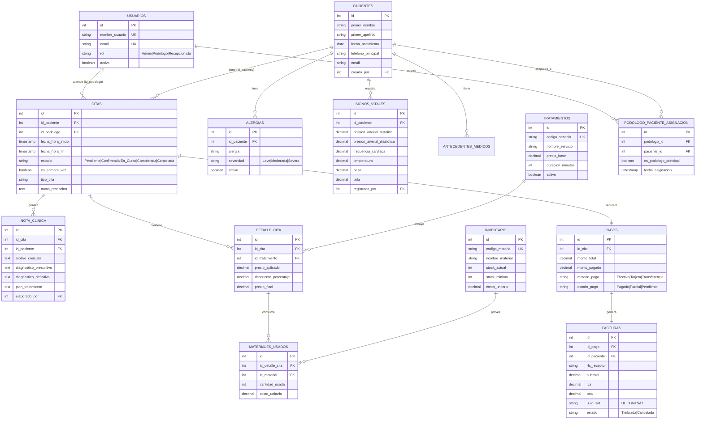
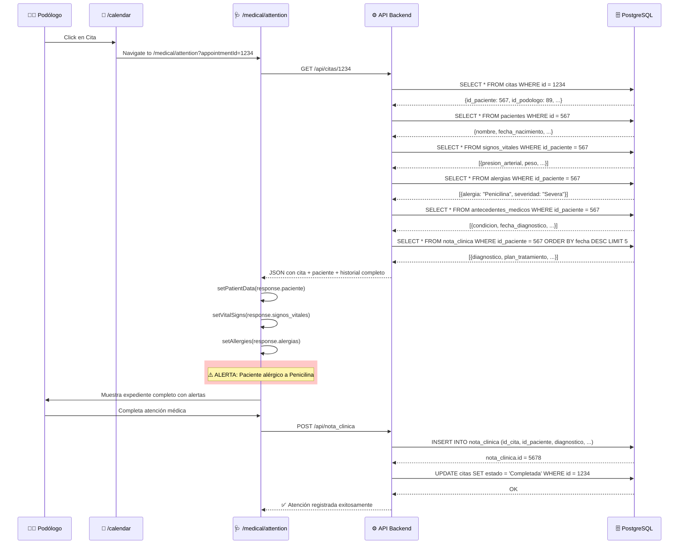
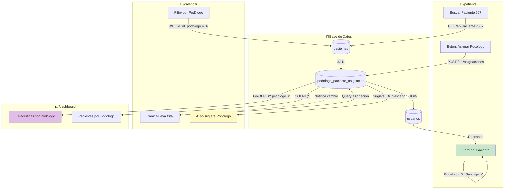
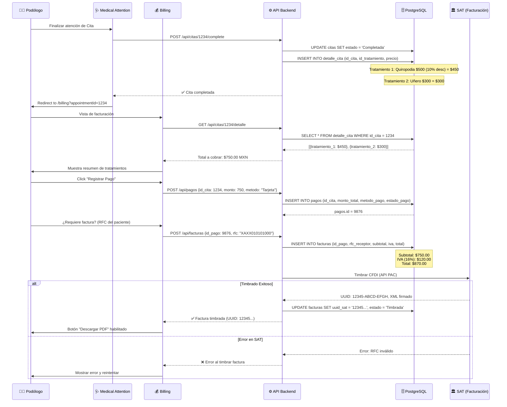
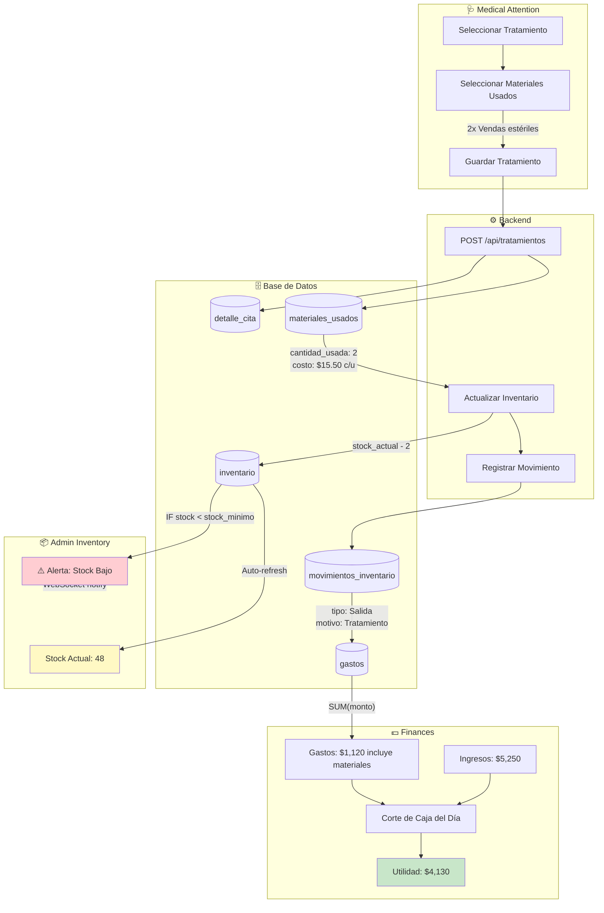
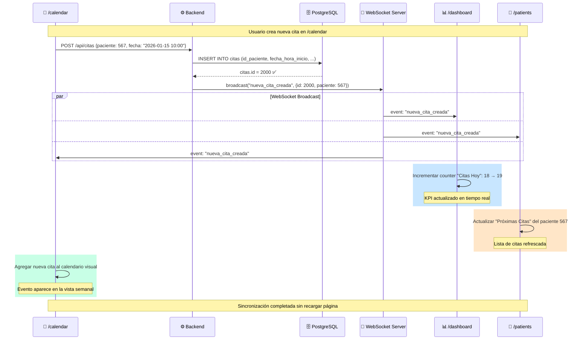
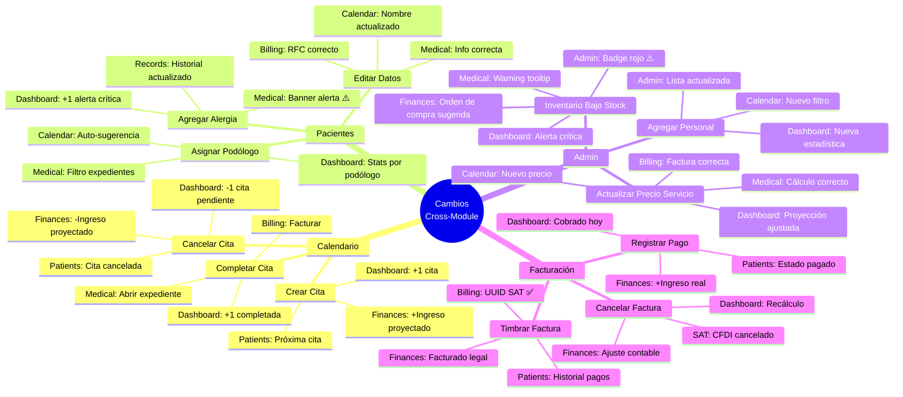
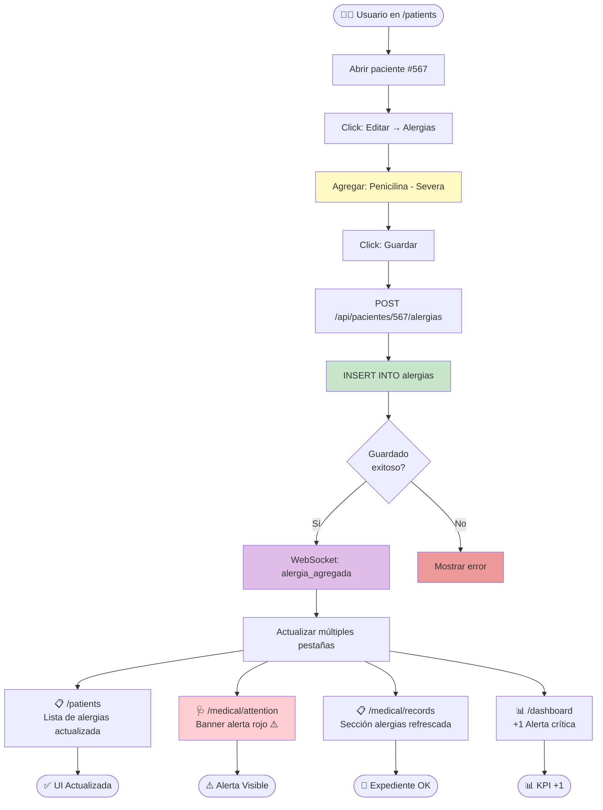
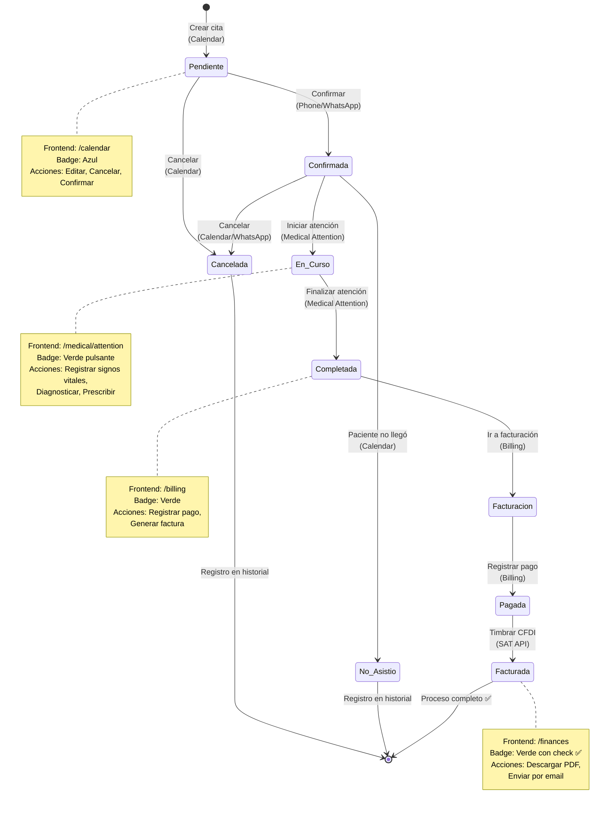
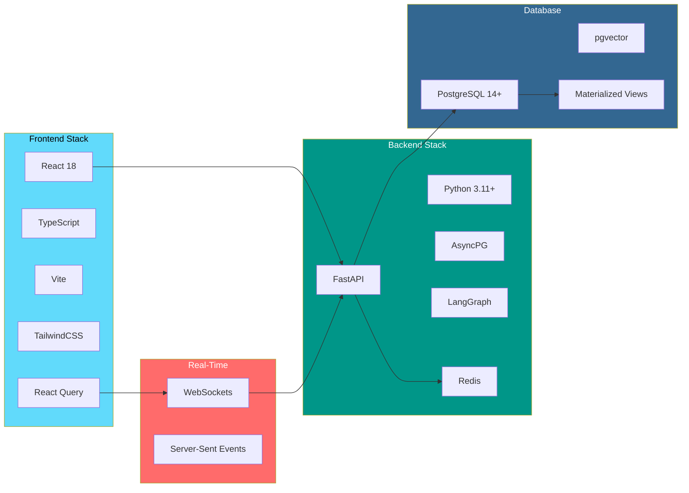

# 📊 DIAGRAMAS: BASE DE DATOS ↔ FRONTEND

## 🗺️ Diagrama 1: Arquitectura General del Sistema

```mermaid
graph TB
    subgraph Frontend["🖥️ FRONTEND (React + TypeScript)"]
        Calendar[📅 Calendar]
        Medical[🩺 Medical Attention]
        Records[📋 Medical Records]
        Patients[👥 Patients]
        Dashboard[📊 Dashboard]
        Billing[💰 Billing]
        Finances[💵 Finances]
        Admin[⚙️ Admin]
    end
    
    subgraph Backend["⚙️ BACKEND (FastAPI)"]
        CitasAPI[/api/citas]
        PacientesAPI[/api/pacientes]
        TratamientosAPI[/api/tratamientos]
        PagosAPI[/api/pagos]
        FacturasAPI[/api/facturas]
        StatsAPI[/api/stats]
        InventoryAPI[/api/inventario]
    end
    
    subgraph Database["🗄️ POSTGRESQL"]
        Citas[(citas)]
        Pacientes[(pacientes)]
        Usuarios[(usuarios)]
        Tratamientos[(tratamientos)]
        Pagos[(pagos)]
        Facturas[(facturas)]
        Inventario[(inventario)]
    end
    
    Calendar --> CitasAPI
    Medical --> CitasAPI
    Medical --> TratamientosAPI
    Patients --> PacientesAPI
    Billing --> PagosAPI
    Billing --> FacturasAPI
    Dashboard --> StatsAPI
    Admin --> InventoryAPI
    
    CitasAPI --> Citas
    PacientesAPI --> Pacientes
    TratamientosAPI --> Tratamientos
    PagosAPI --> Pagos
    FacturasAPI --> Facturas
    StatsAPI --> Citas
    StatsAPI --> Pagos
    InventoryAPI --> Inventario
    
    Citas -.FK.-> Pacientes
    Citas -.FK.-> Usuarios
    Pagos -.FK.-> Citas
    Facturas -.FK.-> Pagos
    
    style Frontend fill:#e3f2fd
    style Backend fill:#fff3e0
    style Database fill:#f3e5f5
```

---

## 📋 Diagrama 2: Modelo de Entidad-Relación (ER) - Tablas Principales



---

## 🔄 Diagrama 3: FLUJO 1 - Cita → Expediente Médico (Auto-carga)



---

## 🔄 Diagrama 4: FLUJO 2 - Paciente → Podólogo Asignado



---

## 🔄 Diagrama 5: FLUJO 3 - Cita → Pago → Factura (Completo)



---

## 🔄 Diagrama 6: FLUJO 4 - Inventario → Tratamiento → Finanzas



---

## 🔄 Diagrama 7: FLUJO 5 - Dashboard Agregaciones Multi-Tabla

```mermaid
graph TB
    subgraph Dashboard["📊 /dashboard"]
        KPICards[KPI Cards]
        Charts[Gráficas Interactivas]
        Alerts[Alertas del Sistema]
    end
    
    subgraph Backend["⚙️ Backend API"]
        StatsEndpoint[GET /api/stats/dashboard]
        AggregateQueries[Queries de Agregación]
    end
    
    subgraph MaterializedView["🗄️ Vista Materializada"]
        DashboardKPIs[(dashboard_kpis)]
        RefreshSchedule[REFRESH cada hora]
    end
    
    subgraph SourceTables["🗄️ Tablas Fuente"]
        Citas[(citas)]
        Pacientes[(pacientes)]
        Pagos[(pagos)]
        Inventario[(inventario)]
        Usuarios[(usuarios)]
        DetalleCita[(detalle_cita)]
        Tratamientos[(tratamientos)]
    end
    
    Dashboard -->|useEffect| StatsEndpoint
    StatsEndpoint --> AggregateQueries
    
    AggregateQueries -->|SELECT * FROM| DashboardKPIs
    
    Citas -->|COUNT, GROUP BY| DashboardKPIs
    Pacientes -->|COUNT DISTINCT| DashboardKPIs
    Pagos -->|SUM(monto_total)| DashboardKPIs
    Inventario -->|WHERE stock < stock_min| DashboardKPIs
    Usuarios -->|JOIN podologos| DashboardKPIs
    DetalleCita -->|JOIN| DashboardKPIs
    Tratamientos -->|COUNT, GROUP BY| DashboardKPIs
    
    RefreshSchedule -.->|Programado| DashboardKPIs
    
    DashboardKPIs -->|Response JSON| StatsEndpoint
    StatsEndpoint -->|Data| KPICards
    
    KPICards -->|"📅 Citas Hoy: 18"| Dashboard
    KPICards -->|"👥 Pacientes: 15 (3 nuevos)"| Dashboard
    KPICards -->|"💰 Ingresos: $8,450"| Dashboard
    KPICards -->|"📦 Alertas: 4 productos"| Dashboard
    
    DashboardKPIs -->|Chart Data| Charts
    Charts -->|Bar Chart| Dashboard
    Charts -->|Line Chart| Dashboard
    Charts -->|Pie Chart| Dashboard
    
    DashboardKPIs -->|Critical Items| Alerts
    
    style KPICards fill:#e3f2fd
    style Alerts fill:#ffebee
    style DashboardKPIs fill:#f3e5f5
```

---

## 🔄 Diagrama 8: Sincronización Real-Time entre Pestañas



---

## 🔄 Diagrama 9: Patrones de Actualización Reactiva

```mermaid
graph TB
    subgraph Pattern1["Patrón 1: Cascada WebSocket"]
        Action1[Acción en Pestaña A]
        Backend1[Backend procesa]
        DB1[Base de Datos actualizada]
        WS1[WebSocket broadcast]
        Update1[Pestañas B, C, D actualizan]
        
        Action1 --> Backend1 --> DB1 --> WS1 --> Update1
    end
    
    subgraph Pattern2["Patrón 2: Polling de Estado"]
        Component2[Componente React]
        Interval2[setInterval 5s]
        Check2[fetchStatus]
        Condition2{Estado cambió?}
        Update2[Actualizar UI]
        
        Component2 --> Interval2 --> Check2 --> Condition2
        Condition2 -->|Sí| Update2
        Condition2 -->|No| Interval2
    end
    
    subgraph Pattern3["Patrón 3: React Query Cache"]
        Query3[useQuery 'patient-567']
        Cache3[Cache local]
        Mutation3[Guardar alergia]
        Invalidate3[invalidateQueries]
        Refetch3[Re-fetch automático]
        
        Query3 --> Cache3
        Mutation3 --> Invalidate3 --> Refetch3
        Refetch3 --> Cache3
    end
    
    subgraph Pattern4["Patrón 4: Context API Global"]
        Context4[GlobalContext]
        Provider4[Provider wrapper]
        Consumer1[/calendar]
        Consumer2[/patients]
        Consumer3[/dashboard]
        
        Provider4 --> Context4
        Context4 -.compartido.-> Consumer1
        Context4 -.compartido.-> Consumer2
        Context4 -.compartido.-> Consumer3
    end
    
    style Pattern1 fill:#e3f2fd
    style Pattern2 fill:#fff3e0
    style Pattern3 fill:#f3e5f5
    style Pattern4 fill:#c8e6c9
```

---

## 📋 Diagrama 10: Mapa de Impactos Cross-Module



---

## 🔍 Diagrama 11: Ejemplo Concreto - Agregar Alergia a Paciente



---

## 🎯 Diagrama 12: Estados de una Cita (State Machine)



---

## 📊 Resumen de Tecnologías Utilizadas



---

## 📝 Convenciones de los Diagramas

### Colores:
- 🔵 **Azul claro** (#e3f2fd): Frontend/UI
- 🟠 **Naranja claro** (#fff3e0): Backend/API
- 🟣 **Púrpura claro** (#f3e5f5): Base de Datos
- 🟢 **Verde claro** (#c8e6c9): Operación exitosa
- 🔴 **Rojo claro** (#ffcdd2): Alertas/Errores
- 🟡 **Amarillo claro** (#fff9c4): En proceso/Pendiente

### Símbolos:
- `FK` = Foreign Key (Llave Foránea)
- `PK` = Primary Key (Llave Primaria)
- `UK` = Unique Key (Llave Única)
- `→` = Flujo de datos
- `-.->` = Relación indirecta/notificación
- `⚠️` = Alerta o advertencia
- `✅` = Operación exitosa
- `❌` = Error o fallo

### Iconos de Módulos:
- 📅 Calendar (Calendario)
- 🩺 Medical (Atención Médica)
- 📋 Records (Expedientes)
- 👥 Patients (Pacientes)
- 📊 Dashboard (Panel)
- 💰 Billing (Facturación)
- 💵 Finances (Finanzas)
- ⚙️ Admin (Administración)
- 🗄️ Database (Base de Datos)
- 🔌 WebSocket (Tiempo Real)
