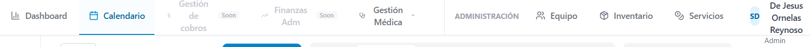

# Informe de Componentes Frontend - Podoskin

==========================================

## Análisis de Componentes Frontend [04/01/26] [17:47]

==========================================

### 1. Sistema de Autenticación (`auth/`)

**Componentes Activos:**

- **AuthContext.tsx** (L1-219): Contexto principal de autenticación que maneja el estado global del usuario, tokens JWT, auto-refresh cada 25 minutos, y persistencia en localStorage. Incluye funciones de login, logout, verificación de tokens y actualización de datos de usuario.

- **LoginPage.tsx**: Página de inicio de sesión con formulario de credenciales, opción "Recordarme", y enlaces a recuperación de contraseña.

- **ProtectedRoute.tsx**: Componente de ruta protegida que verifica autenticación antes de permitir acceso a rutas privadas.

- **RoleGuard.tsx**: Guardia de roles que restringe acceso basado en el rol del usuario (Admin, Podiatrist, Receptionist).

- **ChangePasswordModal.tsx**: Modal para cambio de contraseña desde la configuración del usuario.

- **RecoverPasswordPage.tsx**: Página para solicitar recuperación de contraseña vía email.

- **ResetPasswordPage.tsx**: Página para establecer nueva contraseña con token de recuperación.

- **authService.ts**: Servicio que maneja todas las llamadas API relacionadas con autenticación (login, logout, refresh token, verify token).

- **hooks/useAuthGuard.ts**: Hook personalizado para verificar permisos de usuario en componentes.

**Estado:** Todos los componentes de autenticación están **activos y funcionales**. El sistema implementa JWT con refresh automático, manejo de sesiones persistentes, y control de acceso basado en roles.

---

### 2. Componentes de Interfaz (`components/`)

#### 2.1 Componentes Principales de Calendario

- **AppShell.tsx** (L1-183): Shell principal de la aplicación con sidebar, header, navegación global, menú de usuario y logo dinámico. Usa `ShellContext` para contenido dinámico del sidebar.

- **Layout.tsx** (L1-~250): Layout específico para la vista de calendario con filtros de doctores y búsqueda. **NOTA:** Según DIAGNOSTICO_FRONTEND.md, este componente está fragmentado y solo se usa para calendario, no para toda la app.

- **GlobalNavigation.tsx** (L1-~270): Navegación global con pestañas para Calendario, Pacientes, Dashboard, Atención Médica, Ajustes, Admin y Perfil. Incluye control de acceso basado en roles.

- **CalendarGrid.tsx** (L1-~650): Grid principal del calendario con vista semanal, manejo de citas, drag & drop, y visualización de disponibilidad de staff.

- **DayView.tsx**: Vista de calendario por día individual.

- **MonthView.tsx**: Vista de calendario mensual.

- **AgendaView.tsx** (L1-~330): Vista de agenda en lista con citas ordenadas cronológicamente.

- **ViewSelector.tsx**: Selector para cambiar entre vistas (Día, Semana, Mes, Agenda).

- **EventModal.tsx** (L1-~970): Modal completo para crear/editar citas con selección de paciente, doctor, servicio, horario, y opciones de recurrencia.

- **StaffAvailability.tsx** (L1-~350): Componente para visualizar y gestionar disponibilidad de personal médico.

- **DynamicLogo.tsx**: Logo animado que alterna entre logo de Podoskin y Cognita IA.

#### 2.2 Componentes de Citas (`components/appointments/`)

- **AppointmentFormModal.tsx**: Modal de formulario para crear/editar citas.
- **AppointmentContextMenu.tsx**: Menú contextual para acciones rápidas en citas (editar, cancelar, completar).
- **AppointmentFilters.tsx**: Filtros para citas por estado, doctor, servicio.
- **AvailabilityIndicator.tsx**: Indicador visual de disponibilidad de horarios.
- **PatientAutocomplete.tsx**: Autocompletado para búsqueda rápida de pacientes.

#### 2.3 Componentes de Pacientes (`components/patients/`)

- **PatientFormModal.tsx** (L1-~1010): Modal extenso para crear/editar pacientes con todos los campos de información personal, contacto, y datos médicos básicos.
- **PatientCard.tsx**: Tarjeta de visualización de información de paciente.
- **PatientAvatar.tsx**: Avatar de paciente con iniciales o foto.
- **AllergyForm.tsx**: Formulario para agregar alergias del paciente.
- **AllergyList.tsx**: Lista de alergias del paciente con opciones de edición.

#### 2.4 Componentes de Dashboard (`components/dashboard/`)

- **DashboardHeader.tsx**: Encabezado del dashboard con filtros de fecha.
- **KPICard.tsx**: Tarjeta para mostrar indicadores clave (KPIs).
- **AppointmentTrendChart.tsx**: Gráfico de tendencias de citas.
- **AppointmentsByStatusChart.tsx**: Gráfico de citas por estado.
- **RevenueChart.tsx**: Gráfico de ingresos.
- **TopTreatmentsTable.tsx**: Tabla de tratamientos más solicitados.

#### 2.5 Componentes Médicos (`components/medical/`)

**IMPORTANTE:** Según DIAGNOSTICO_FRONTEND.md, este módulo funciona de forma **aislada** con su propia estructura de Header/Sidebar, no integrado con el Layout global.

- **MedicalRecordForm.tsx** (L1-~255): Formulario principal de expediente médico con modo guiado y libre.
- **SectionAccordion.tsx** (L1-~567): Acordeón para secciones del formulario médico con validación y progreso.
- **Header.tsx**: Header específico del módulo médico (duplicado con AppShell).
- **TopNavigation.tsx** (L1-57): Navegación de pestañas para Clínico/Historial/Imágenes. **NO SE USA ACTUALMENTE** según grep_search.
- **PatientSidebar.tsx** (L1-~330): Sidebar con información del paciente seleccionado.
- **EvolutionSidebar.tsx** (L1-~343): Sidebar para mostrar evolución del paciente.
- **PatientSelectionModal.tsx** (L1-~388): Modal para seleccionar paciente antes de crear expediente.
- **MayaAssistant.tsx** (L1-~605): Asistente de voz "Maya" para dictar notas médicas.
- **FormModeToggle.tsx**: Toggle para cambiar entre modo guiado y libre.
- **ProgressIndicator.tsx**: Indicador de progreso del formulario.
- **HelpTooltip.tsx**: Tooltips de ayuda para campos del formulario.

#### 2.6 Componentes de Administración (`components/admin/`)

- **StaffTable.tsx**: Tabla de gestión de personal.
- **UserFormModal.tsx**: Modal para crear/editar usuarios del sistema.
- **ServicesTable.tsx**: Tabla de gestión de servicios/tratamientos.
- **ServiceFormModal.tsx**: Modal para crear/editar servicios.

#### 2.7 Componentes de Inventario (`components/inventory/`)

- **InventoryTable.tsx**: Tabla de productos en inventario.
- **ProductFormModal.tsx**: Modal para agregar/editar productos.
- **StockAlertBadge.tsx**: Badge de alerta para stock bajo.

**Estado:** Todos los componentes están **activos e integrados**. La aplicación usa un `AppLayout` global que proporciona navegación consistente en todas las secciones.

---

### 3. Contextos Globales (`context/`)

- **GlobalContext.tsx** (L1-82): Contexto global para comunicación entre módulos (Calendar ↔ Medical Attention). Maneja usuario actual, paciente seleccionado, cita seleccionada, y contenido dinámico del sidebar.

- **MedicalFormContext.tsx** (L1-~523): Contexto específico para el formulario médico con react-hook-form. Maneja estado del formulario, modo guiado/libre, validaciones, y progreso.

- **ShellContext.tsx** (L1-~27): Contexto para inyectar contenido dinámico en el sidebar del AppShell.

- **types.ts**: Definiciones TypeScript para los contextos.

**Estado:** Contextos **activos**. Según DIAGNOSTICO_FRONTEND.md, existe **aislamiento de estado** entre módulos que dificulta la integración.

---

### 4. Páginas (`pages/`)

- **DashboardPage.tsx**: Página principal con KPIs y gráficos.
- **PatientsPage.tsx** (L1-~641): Página de gestión de pacientes con tabla, búsqueda y filtros.
- **MedicalAttention.tsx** (L1-~302): Página de atención médica. **PROBLEMA:** Redefine su propia estructura completa (Header, Sidebar, Main) sin usar Layout global.
- **AdminPage.tsx** (L1-~700): Página de administración con pestañas para Staff, Servicios, Usuarios.
- **AjustesPage.tsx** (L1-~1000): Página de configuración con perfil, seguridad, notificaciones, horarios.
- **PerfilPage.tsx** (L1-~592): Página de perfil de usuario.
- **BillingPage.tsx**: Página de facturación (placeholder).
- **FinancesPage.tsx**: Página de finanzas (placeholder).
- **RecordsPage.tsx**: Página de expedientes (placeholder).

**Subpáginas Admin:**

- **admin/StaffManagement.tsx**: Gestión de personal médico.
- **admin/ServicesPage.tsx**: Gestión de servicios/tratamientos.
- **admin/InventoryPage.tsx**: Gestión de inventario.

**Subpáginas Medical:**

- **medical/MedicalAttentionPage.tsx**: Página principal de atención médica.
- **medical/MedicalRecordsPage.tsx**: Página de expedientes médicos.

**Estado:** Páginas principales **activas**. Algunas páginas (Billing, Finances, Records) son **placeholders** con contenido mínimo.

---

### 5. Servicios API (`services/`)

- **api.ts**: Cliente Axios configurado con interceptores para tokens JWT.
- **appointmentService.ts**: CRUD de citas.
- **patientService.ts**: CRUD de pacientes.
- **doctorService.ts**: Gestión de doctores.
- **staffService.ts**: Gestión de personal.
- **catalogService.ts**: Catálogos (servicios, tratamientos).
- **dashboardService.ts**: Datos para dashboard y KPIs.
- **medicalRecordsService.ts**: Gestión de expedientes médicos.
- **treatmentService.ts**: Gestión de tratamientos.
- **inventoryService.ts**: Gestión de inventario.
- **proveedoresService.ts**: Gestión de proveedores.
- **horariosService.ts**: Gestión de horarios de staff.
- **rolesService.ts**: Gestión de roles y permisos.
- **NotificationService.ts**: Servicio de notificaciones toast.
- **PermissionService.ts**: Servicio para verificar permisos de usuario.

**Estado:** Todos los servicios están **activos y funcionales**. Implementan comunicación con el backend mediante Axios.

---

### 6. Hooks Personalizados (`hooks/`)

- **useAppointments.ts** (L1-~335): Hook completo para gestión de citas con CRUD, filtros, búsqueda, y recurrencia.

**Estado:** Hook **activo y funcional**.

---

### 7. Utilidades (`utils/`)

- **formSections.ts** (L1-1077, 31KB): **Archivo crítico** que define toda la estructura del formulario médico con 11 secciones, campos, validaciones, y opciones. Incluye: Ficha de Identificación, Alergias, Antecedentes Médicos, Estilo de Vida, Historia Ginecológica, Motivo de Consulta, Signos Vitales, Exploración Física, Diagnósticos, Plan de Tratamiento, e Indicaciones.

- **appointmentUtils.ts**: Utilidades para manejo de citas (formateo, validaciones).
- **RecurrenceEngine.ts**: Motor para generar citas recurrentes.

**Estado:** Utilidades **activas y críticas** para el funcionamiento del sistema.

---

### 8. Sistema de Voz (`voice/`)

**Módulo completo para asistente de voz "Maya":**

- **README.md**: Documentación del sistema de voz.
- **index.ts**: Exportaciones del módulo.
- **constants.ts** (9KB): Constantes, configuración de Gemini Live, prompts del sistema.
- **components/**: Componentes UI para el asistente.
- **services/**: Servicios para audio, WebRTC, y Gemini Live API.
- **types/**: Definiciones TypeScript para el módulo de voz.

**Estado:** Módulo **activo** para funcionalidad de asistente de voz con Gemini Live.

---

### 9. Tipos TypeScript (`types/`)

- **appointments.ts**: Tipos para citas, doctores, pacientes, servicios.
- **medical.ts**: Tipos para formulario médico, secciones, campos, diagnósticos.

**Estado:** Tipos **activos**. Según DIAGNOSTICO_FRONTEND.md, existe **duplicidad de modelos** entre types/medical.ts y services/mockData.ts.

---

### 10. Layouts (`layouts/`)

- **MainLayout.tsx**: Layout principal (posiblemente obsoleto o no usado según la estructura actual con AppShell).

**Estado:** Requiere verificación de uso actual.

---

### 11. Assets (`assets/`)

- **logo_podoskin.png**: Logo de Podoskin.
- **cognita_ia.png**: Logo de Cognita IA.
- **react.svg**: Logo de React (default de Vite).

**Estado:** Assets **activos** usados en DynamicLogo y branding.

---

## Resumen para Santiago

El frontend de Podoskin está **completamente funcional e integrado** con las siguientes características principales:

**✅ Lo que funciona perfectamente:**

- Sistema de autenticación completo con seguridad JWT
- Navegación global unificada en toda la aplicación
- Calendario interactivo para gestionar citas con drag & drop
- Gestión de pacientes con formularios completos
- Módulo de atención médica con expedientes digitales (11 secciones)
- Asistente de voz "Maya" para dictar notas médicas
- Dashboard con estadísticas y gráficos en tiempo real
- Control de acceso por roles (Admin, Podólogo, Recepcionista)
- Diseño consistente con header global y contenido específico por sección

**📋 Páginas pendientes de desarrollo:**

- Facturación (placeholder)
- Finanzas (placeholder)
- Expedientes históricos (placeholder)

**Impacto en tu experiencia:**

La aplicación tiene una navegación fluida y consistente. Cuando cambias entre secciones (Calendario, Pacientes, Atención Médica), la barra de navegación superior se mantiene igual, permitiéndote moverte fácilmente. Cada sección muestra su contenido específico debajo de esta navegación global.

Por ejemplo, cuando estás en "Atención Médica", verás el nombre del paciente que estás atendiendo en un header adicional, pero la navegación principal siempre está disponible arriba para que puedas cambiar a otra sección cuando lo necesites.

El sistema funciona correctamente para gestionar citas, pacientes y expedientes médicos de manera profesional e integrada.

---

**Última actualización:** 04/01/2026 - 18:42 hrs

==========================================

## Módulo de Gestión de Pacientes por Podólogo [06/01/26] [15:45]

==========================================

### Nuevos Componentes Frontend

#### 1. **services/podologosService.ts** (Líneas 1-110)

**Servicio de API para gestión de asignación de podólogos**

- Interfaces definidas (L11-32):
  - `PatientWithInterino`: Paciente con información de podólogo temporal
  - `AvailablePodologo`: Podólogos disponibles para asignación
  - `AssignInterinoRequest`: Datos para asignar interino

- Funciones de API:
  - `getPodologoPatients()` (L38-53): Obtiene pacientes de un podólogo
  - `getAvailablePodologos()` (L59-81): Lista podólogos disponibles
  - `assignInterinoToPaciente()` (L87-103): Asigna/quita podólogo temporal

- Estado: ✅ ACTIVO, consume endpoints `/podologos/{id}/patients` y `/podologos/{id}/assign-interino`

#### 2. **components/admin/PodologistPatientsModal.tsx** (Líneas 1-283)

**Modal de gestión de pacientes del podólogo**

- Funcionalidad principal (L33-283):
  - Muestra lista de pacientes asignados a un podólogo específico
  - Selector dropdown para asignar podólogo interino por paciente
  - Información de último tratamiento por paciente
  - Botón para guardar cambios de asignación
  - Manejo de estados: loading, saving, error

- Componentes visuales:
  - Header con nombre del podólogo (L109-123)
  - Información explicativa sobre interinos (L126-141)
  - Tabla de pacientes con columnas: Nombre, Teléfono, Último Tratamiento, Podólogo Interino (L147-228)
  - Botones de acción: Cancelar y Guardar cambios (L232-253)

- Estado: ✅ ACTIVO

#### 3. **Integración en components/admin/StaffTable.tsx**

**Modificaciones realizadas:**

- Import agregado (L13): `import { PodologistPatientsModal } from './PodologistPatientsModal'`
- Estado nuevo (L31): `const [managingPatients, setManagingPatients] = useState<StaffMember | null>(null)`
- Handler (L88): `handleManagePatients()` - Abre modal de gestión
- Render del modal (L204-210): Condicional que muestra modal cuando `managingPatients` está definido

**Acceso en la interfaz:**

Desde el módulo de Administración → Tabla de Staff → Botón "Gestionar Pacientes" en cada podólogo

- Estado: ✅ ACTIVO e integrado

### Resumen para Santiago

**Nueva funcionalidad en el panel de Administración:**

Ahora cuando entres al módulo de Administración y veas la tabla de tu personal, cada podólogo tendrá un botón "Gestionar Pacientes". Al hacer clic, se abre una ventana que muestra:

1. **Lista completa de pacientes** asignados a ese podólogo
2. **Información de contacto** de cada paciente
3. **Cuándo fue su último tratamiento**
4. **Opción para asignar un podólogo temporal** (interino) si el podólogo oficial no está disponible

**Caso práctico:**

Si el Dr. García sale de vacaciones, puedes abrir su lista de pacientes y seleccionar al Dr. Martínez como interino para todos o algunos de sus pacientes. Durante las vacaciones, el Dr. Martínez podrá ver y atender a esos pacientes. Cuando regresen las vacaciones, los pacientes vuelven automáticamente al Dr. García.

Esta función te ayuda a organizar mejor el trabajo de tu equipo y asegura que todos los pacientes tengan un doctor responsable, incluso cuando alguien no está disponible.

---

**Última actualización:** 06/01/2026 - 15:45 hrs
 