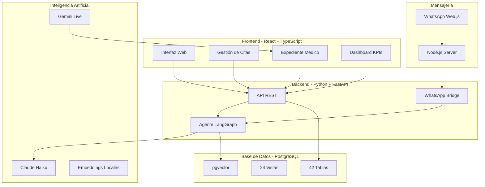

# Business Requirements Document (BRD)

## Podoskin Solution - Sistema Integral de Gestión Clínica para Podología

---

**Fecha de Creación**: 25 de Diciembre, 2024  
**Versión**: 1.0  
**Propietario del Proyecto**: Dr. Santiago de Jesús Ornelas Reynoso  
**Preparado por**: Equipo de Desarrollo Podoskin

---

## 📋 Resumen Ejecutivo

### Visión del Proyecto

Podoskin Solution es un **sistema integral de gestión clínica especializado en podología** que combina tecnologías de inteligencia artificial de última generación con una plataforma completa de gestión médica, CRM y operaciones clínicas.

### Propósito del Sistema

Crear una solución end-to-end que permita:

1. **Gestión clínica eficiente** con expedientes médicos digitales completos
2. **Asistencia por IA** mediante voz (Gemini Live) y chat (Claude)
3. **Atención al cliente automatizada** vía WhatsApp con escalamiento inteligente
4. **Control operacional completo** incluyendo inventario, pagos, citas y reportes
5. **Cumplimiento normativo** con estándares COFEPRIS

### Alcance del Proyecto

- **Usuarios objetivo**: Clínicas de podología, podólogos, personal administrativo, pacientes
- **Plataformas**: Web (Frontend React), Backend Python, WhatsApp, Base de datos PostgreSQL
- **Módulos principales**: 8 módulos integrados
- **Tecnologías IA**: Gemini Live (Google), Claude Haiku (Anthropic), LangGraph

---

## 🎯 Objetivos del Negocio

### Objetivos Primarios

1. **Digitalización completa del expediente médico**
   - Eliminar uso de papel en consultas
   - Cumplir con normativas COFEPRIS
   - Acceso rápido a historial del paciente

2. **Automatización de procesos administrativos**
   - Reducir tiempo de agendamiento en 70%
   - Automatizar recordatorios de citas
   - Gestión automática de inventario

3. **Mejora en la experiencia del paciente**
   - Atención 24/7 vía WhatsApp
   - Respuestas instantáneas a consultas comunes
   - Proceso de agendamiento simplificado

4. **Optimización de operaciones clínicas**
   - Reducir tiempo de captura de datos en consulta en 60%
   - Asistencia por voz durante la consulta
   - Generación automática de documentos médicos

### Objetivos Secundarios

1. **Análisis de datos y KPIs**
   - Dashboard ejecutivo en tiempo real
   - Identificación de patrones de cancelación
   - Análisis de rentabilidad por tratamiento

2. **Escalabilidad**
   - Soporte para múltiples podólogos
   - Gestión de horarios y turnos
   - Base de conocimiento auto-aprendiente

---

## 👥 Stakeholders

### Stakeholders Primarios

| Rol | Responsabilidad | Necesidades Clave |
|-----|----------------|-------------------|
| **Dr. Santiago Ornelas** | Propietario/Podólogo Principal | Sistema eficiente, cumplimiento normativo, análisis de negocio |
| **Podólogos** | Usuarios médicos | Captura rápida de datos, acceso a historial, asistencia IA |
| **Personal Administrativo** | Recepción/Facturación | Agendamiento simple, gestión de pagos, reportes |
| **Pacientes** | Usuarios finales | Atención rápida, agendamiento fácil, información clara |

### Stakeholders Secundarios

- **Autoridades COFEPRIS**: Cumplimiento normativo
- **Proveedores de materiales**: Integración de inventario
- **Equipo de desarrollo**: Mantenimiento y evolución del sistema

---

## 🏗️ Arquitectura del Sistema

### Componentes Principales



### Stack Tecnológico

#### Frontend

- **Framework**: React 18.3 + TypeScript
- **Build Tool**: Vite
- **Styling**: Tailwind CSS
- **Routing**: React Router DOM
- **State Management**: Context API + React Hook Form
- **UI Components**: Lucide React (iconos), date-fns (fechas)

#### Backend

- **Framework**: FastAPI (Python)
- **IA Framework**: LangGraph + LangChain
- **LLM**: Claude Haiku 3 (Anthropic)
- **Embeddings**: all-MiniLM-L6-v2 (local, 384 dimensiones)
- **Async**: asyncio + asyncpg

#### Base de Datos

- **DBMS**: PostgreSQL 16
- **Extensiones**: pgvector (búsqueda semántica)
- **ORM**: SQL directo con asyncpg
- **Migraciones**: Scripts SQL numerados

#### Mensajería

- **WhatsApp**: whatsapp-web.js (Node.js)
- **Autenticación**: LocalAuth (persistente)
- **Bridge**: FastAPI webhook

#### IA y ML

- **Asistente de Voz**: Gemini Live (Google)
- **Chatbot**: Claude Haiku 3 (Anthropic)
- **RAG**: pgvector + embeddings locales
- **Clasificación**: LangGraph state machine

---

## 📦 Módulos Funcionales

### 1. Gestión de Pacientes y Expediente Médico

#### Descripción

Sistema completo de expediente médico digital que cumple con normativas COFEPRIS.

#### Funcionalidades Clave

**Ficha de Identificación**

- Datos personales completos (nombre, CURP, fecha nacimiento, etc.)
- Domicilio y contacto
- Información de referencia

**Historial Médico**

- Alergias (tipo, severidad, reacciones)
- Antecedentes heredofamiliares
- Antecedentes patológicos, quirúrgicos, traumáticos
- Estilo de vida (dieta, ejercicio, hábitos)
- Historia ginecológica (condicional)

**Consulta Médica**

- Motivo de consulta
- Signos vitales (peso, talla, IMC auto-calculado, TA, FC, etc.)
- Exploración física detallada
- Diagnósticos (presuntivo, definitivo, diferencial)
- Códigos CIE-10 (catálogo de 30+ códigos)
- Plan de tratamiento
- Indicaciones y pronóstico

**Evolución del Tratamiento**

- Seguimiento por fases
- Evaluación de resultados
- Ajustes al plan

#### Requisitos Técnicos

- 150+ campos estructurados
- Validación en tiempo real
- Auto-guardado cada 30 segundos
- Modo guiado y modo libre
- Archivos multimedia (fotos clínicas, estudios)

#### Criterios de Aceptación

- ✅ Captura completa de expediente en menos de 10 minutos
- ✅ Cumplimiento 100% con COFEPRIS
- ✅ Búsqueda de paciente en menos de 2 segundos
- ✅ Generación de documentos imprimibles

---

### 2. Asistente de Voz con Gemini Live

#### Descripción

Asistente inteligente que permite captura de datos por voz durante la consulta médica.

> **Arquitectura**: Sistema híbrido TTS+STT+Function Calling basado en [gemini-live-voice-controller/](file:///c:/Users/Salva/OneDrive/Documentos/Database/gemini-live-voice-controller)

#### Funcionalidades Clave

**Function Calling (8 funciones)**

1. `update_vital_signs()` - Actualizar signos vitales
2. `update_physical_exam()` - Registrar exploración física
3. `add_diagnosis()` - Agregar diagnóstico
4. `query_patient_data()` - Consultar historial
5. `search_cie10()` - Buscar códigos CIE-10
6. `add_treatment()` - Agregar tratamiento
7. `generate_summary()` - Generar resumen de consulta
8. `save_consultation()` - Guardar consulta completa

**Capacidades**

- Transcripción en tiempo real
- Llenado automático de formularios
- Consultas al historial del paciente
- Generación de resúmenes automáticos
- Auditoría completa de acciones

#### Flujo de Uso

```
Doctor: "Peso 75 kilos, talla 170, presión 120/80"
IA: [Llama update_vital_signs()]
IA: "Registrado. IMC: 25.95"

Doctor: "¿Tiene alergias?"
IA: [Llama query_patient_data()]
IA: "Sí, alergia a penicilina desde 2020"
```

#### Requisitos Técnicos

- Latencia < 1 segundo
- Precisión de transcripción > 95%
- Integración con base de datos en tiempo real
- Almacenamiento de grabaciones (opcional)

#### Criterios de Aceptación

- ✅ Reducción de 60% en tiempo de captura
- ✅ 95% de precisión en reconocimiento de voz
- ✅ Respuesta en menos de 1 segundo

---

### 3. Sistema de Citas y Agenda

#### Descripción

Gestión completa de citas con validación de disponibilidad y recordatorios automáticos.

#### Funcionalidades Clave

**Agendamiento**

- Validación de horarios disponibles
- Bloqueos de agenda (vacaciones, días festivos)
- Tipos de cita (consulta, seguimiento, urgencia)
- Asignación de podólogo
- Duración configurable por tipo de servicio

**Recordatorios Automáticos**

- Recordatorio 24 horas antes
- Recordatorio 2 horas antes
- Envío por WhatsApp
- Confirmación de asistencia

**Gestión de Cancelaciones**

- Registro de motivo
- Análisis de patrones
- Seguimiento post-cancelación
- Identificación de pacientes con alta tasa de cancelación

**Horarios de Trabajo**

- Configuración por podólogo
- Horarios especiales
- Días festivos
- Capacidad mensual automática

#### Requisitos Técnicos

- Función SQL: `obtener_horarios_disponibles()`
- Función SQL: `calcular_capacidad_mensual()`
- Vista: `cancelaciones_periodo`
- Tabla: `horarios_trabajo`, `bloqueos_agenda`

#### Criterios de Aceptación

- ✅ Cero conflictos de horarios
- ✅ Recordatorios enviados 100% automáticamente
- ✅ Reducción de 30% en no-shows

---

### 4. CRM y Chatbot de WhatsApp

#### Descripción

Sistema de atención al cliente 24/7 vía WhatsApp con IA conversacional y escalamiento inteligente.

#### Funcionalidades Clave

**Chatbot Maya (Claude Haiku)**

- Clasificación automática de intenciones
- Respuestas a consultas frecuentes
- Agendamiento de citas
- Cancelación/reagendamiento
- Información de servicios y precios

**Sistema de Escalamiento**

- Detección automática de dudas no resueltas
- Notificación al administrador
- Formato estructurado: `#RESPUESTA_XXX`
- Guardado en base de conocimiento
- Expiración de dudas (24 horas)

**Base de Conocimiento Auto-Aprendiente**

- Embeddings semánticos (all-MiniLM-L6-v2)
- Búsqueda por similitud (threshold: 0.85)
- Auto-aprendizaje de respuestas del admin
- Contador de consultas
- Categorización automática

**Gestión de Contactos**

- Multicanal (WhatsApp, Telegram, Facebook)
- Historial completo de conversaciones
- Categorización automática
- Métricas de conversión

#### Arquitectura del Agente

```
Usuario → WhatsApp → Node.js → FastAPI Bridge → LangGraph Agent
                                                      ↓
                                            [classify_intent]
                                                      ↓
                                    ┌─────────────────┼─────────────────┐
                                    ↓                 ↓                 ↓
                            [check_patient]   [retrieve_context]  [handle_query]
                                    ↓                 ↓                 ↓
                            [handle_appointment] [handle_query]  [generate_response]
                                    ↓                 ↓                 ↓
                                    └─────────────────┼─────────────────┘
                                                      ↓
                                        [post_process_escalation]
                                                      ↓
                                              [Respuesta Final]
```

#### Requisitos Técnicos

- Tabla: `conversaciones`, `mensajes`, `dudas_pendientes`, `knowledge_base`
- LLM: Claude Haiku 3 (latencia 0.4s)
- Embeddings: all-MiniLM-L6-v2 (384 dim)
- WhatsApp: whatsapp-web.js + LocalAuth

#### Criterios de Aceptación

- ✅ Respuesta en menos de 3 segundos
- ✅ 80% de consultas resueltas sin intervención humana
- ✅ 95% de precisión en clasificación de intenciones
- ✅ Base de conocimiento crece automáticamente

---

### 5. Control de Inventario

#### Descripción

Sistema completo de gestión de inventario de materiales y productos médicos.

#### Funcionalidades Clave

**Catálogo de Productos**

- Código de producto
- Nombre y descripción
- Categoría
- Precio de compra y venta
- Stock mínimo
- Fecha de caducidad

**Movimientos de Inventario**

- Entradas (compras)
- Salidas (uso en tratamientos)
- Ajustes manuales
- Descuento automático al completar cita

**Alertas y Reportes**

- Stock bajo (vista `alertas_stock_bajo`)
- Productos próximos a caducar
- Productos más usados
- Valor del inventario en tiempo real

**Relación con Tratamientos**

- Materiales requeridos por tratamiento
- Descuento automático de inventario
- Costo real por tratamiento

#### Requisitos Técnicos

- Tabla: `productos_inventario`, `movimientos_inventario`, `tratamiento_materiales`
- Función: `registrar_entrada_inventario()`, `registrar_salida_inventario()`
- Vista: `alertas_stock_bajo`, `productos_mas_usados`, `valor_inventario_actual`

#### Criterios de Aceptación

- ✅ Actualización automática en tiempo real
- ✅ Alertas de stock bajo enviadas diariamente
- ✅ Cero faltantes de material durante consultas

---

### 6. Gestión de Pagos y Facturación

#### Descripción

Sistema completo de cobro, pagos y facturación electrónica.

#### Funcionalidades Clave

**Procesamiento de Pagos**

- Múltiples métodos (efectivo, tarjeta, transferencia)
- Pagos parciales
- Saldo pendiente
- Historial de pagos

**Facturación**

- Generación de facturas
- RFC del paciente
- Notas de cobro imprimibles
- Control de folios

**Reportes Financieros**

- Ingresos por período
- Ingresos por tratamiento
- Pagos pendientes
- Análisis de rentabilidad

#### Requisitos Técnicos

- Tabla: `pagos`, `facturas`
- Vista: `reporte_ingresos`, `pagos_pendientes`
- Función: `generar_nota_cobro()`

#### Criterios de Aceptación

- ✅ Registro de pago en menos de 30 segundos
- ✅ Generación de factura automática
- ✅ Reportes financieros en tiempo real

---

### 7. Dashboard y KPIs

#### Descripción

Dashboard ejecutivo con métricas clave del negocio en tiempo real.

#### Funcionalidades Clave

**KPIs Principales**

- Ingresos del mes
- Número de pacientes atendidos
- Tasa de ocupación de agenda
- Tratamientos más solicitados
- Tasa de cancelación
- Valor promedio por paciente

**Análisis de Pacientes**

- Scoring de pacientes (adherencia, valor, riesgo)
- Top pacientes por valor
- Pacientes que requieren seguimiento
- Análisis de conversiones CRM

**Análisis de Operaciones**

- Capacidad mensual de agenda
- Productos con stock bajo
- Alertas del sistema
- Métricas de chatbot

#### Requisitos Técnicos

- Vista: `dashboard_ejecutivo`, `kpis_mensuales`, `alertas_sistema`
- Vista: `tratamientos_mas_solicitados`, `top_pacientes_valor`
- Vista: `pacientes_requieren_seguimiento`

#### Criterios de Aceptación

- ✅ Dashboard carga en menos de 2 segundos
- ✅ Actualización en tiempo real
- ✅ Exportación a PDF/Excel

---

### 8. Documentos e Impresión

#### Descripción

Generación automática de documentos médicos y administrativos para cumplimiento COFEPRIS.

#### Funcionalidades Clave

**Documentos Médicos**

- Historial médico completo
- Notas clínicas
- Evoluciones de tratamiento
- Consentimientos informados
- Recetas médicas

**Documentos Administrativos**

- Notas de cobro
- Facturas
- Reportes de citas

**Control de Archivo Físico**

- Registro de documentos impresos
- Ubicación de archivo físico
- Documentos pendientes de archivar
- Firmas digitales con trazabilidad

#### Requisitos Técnicos

- Tabla: `documentos_generados`, `firmas_digitales`
- Función: `generar_historial_medico_completo()`, `generar_nota_cobro()`
- Vista: `documentos_pendientes_archivo`
- Plantillas HTML personalizables

#### Criterios de Aceptación

- ✅ Generación de documentos en menos de 5 segundos
- ✅ 100% cumplimiento COFEPRIS
- ✅ Firmas digitales válidas

---

## 📊 Modelo de Datos

### Estadísticas de Base de Datos

- **Total de Tablas**: 42
- **Total de Vistas**: 24
- **Total de Funciones**: 15+
- **Extensiones**: pgvector

### Tablas Principales por Módulo

#### Usuarios y Autenticación (2 tablas)

- `usuarios`
- `podologos`

#### Pacientes (6 tablas)

- `pacientes`
- `alergias`
- `antecedentes_heredofamiliares`
- `antecedentes_patologicos`
- `antecedentes_quirurgicos`
- `archivos_paciente`

#### Citas y Tratamientos (8 tablas)

- `citas`
- `tratamientos`
- `detalle_cita`
- `notas_clinicas`
- `signos_vitales`
- `diagnosticos`
- `pagos`
- `facturas`

#### CRM y Chatbot (10 tablas)

- `contactos`
- `conversaciones`
- `mensajes`
- `plantillas_mensaje`
- `respuestas_automaticas`
- `metricas_chatbot`
- `dudas_pendientes`
- `knowledge_base`
- `etiquetas_conversacion`
- `conversiones`

#### Asistente de Voz (7 tablas)

- `sesiones_voz`
- `transcripciones`
- `acciones_ia`
- `resumenes_consulta`
- `analisis_conversacion`
- `grabaciones_audio`
- `contexto_proyecto`

#### Inventario (3 tablas)

- `productos_inventario`
- `movimientos_inventario`
- `tratamiento_materiales`

#### Horarios y Personal (2 tablas)

- `horarios_trabajo`
- `bloqueos_agenda`

#### Documentos (2 tablas)

- `documentos_generados`
- `firmas_digitales`

---

## 🔐 Seguridad y Cumplimiento

### Cumplimiento Normativo

**COFEPRIS**

- ✅ Expediente médico completo
- ✅ Firmas digitales con trazabilidad
- ✅ Archivo físico controlado
- ✅ Consentimientos informados
- ✅ Códigos CIE-10 oficiales

**Protección de Datos**

- Encriptación de datos sensibles
- Control de acceso por roles
- Auditoría de acciones
- Backup automático diario

### Roles y Permisos

| Rol | Permisos |
|-----|----------|
| **Administrador** | Acceso completo, configuración, reportes financieros |
| **Podólogo** | Expediente médico, citas, tratamientos, inventario |
| **Recepción** | Agendamiento, pagos, contacto con pacientes |
| **Paciente** | Ver su historial, agendar citas (WhatsApp) |

---

## 💰 Análisis de Costos

### Costos de IA

**Claude Haiku 3 (Chatbot)**

- Input: $1.00 por millón de tokens
- Output: $5.00 por millón de tokens
- Estimado mensual (1000 conversaciones): **$1.25/mes**
- Estimado anual: **~$15 USD**

**Gemini Live (Asistente de Voz)**

- Según plan de Google Cloud
- Estimado: **Variable según uso**

**Embeddings**

- all-MiniLM-L6-v2: **Gratuito (local)**

### Costos de Infraestructura

- **Base de datos**: PostgreSQL (auto-hospedado o cloud)
- **Backend**: Servidor Python (auto-hospedado o cloud)
- **Frontend**: Hosting estático (Vercel/Netlify gratuito)
- **WhatsApp**: whatsapp-web.js (gratuito)

---

## 📈 Métricas de Éxito

### KPIs Operacionales

| Métrica | Objetivo | Medición |
|---------|----------|----------|
| Tiempo de captura de expediente | < 10 min | Por consulta |
| Tiempo de agendamiento | < 2 min | Por cita |
| Tasa de respuesta chatbot | > 80% | Mensajes resueltos sin humano |
| Precisión de IA | > 95% | Clasificación de intenciones |
| Tiempo de respuesta WhatsApp | < 3 seg | Por mensaje |
| Reducción de no-shows | 30% | Comparado con baseline |

### KPIs de Negocio

| Métrica | Objetivo | Medición |
|---------|----------|----------|
| Satisfacción del paciente | > 4.5/5 | Encuestas |
| Ingresos por paciente | Incremento 20% | Anual |
| Eficiencia operativa | Reducción 40% tiempo admin | Mensual |
| Retención de pacientes | > 70% | Anual |

---

## 🚀 Plan de Implementación

### Fase 1: Fundamentos (Completado ✅)

- ✅ Base de datos completa (42 tablas)
- ✅ Backend con FastAPI
- ✅ Frontend básico con React

### Fase 2: IA y Automatización (En Progreso 🔄)

- ✅ Chatbot WhatsApp con LangGraph
- ✅ Sistema de escalamiento
- ✅ Base de conocimiento
- 🔄 Integración Gemini Live
- 🔄 Function calling completo

### Fase 3: Optimización (Pendiente 📋)

- 📋 Dashboard ejecutivo
- 📋 Reportes avanzados
- 📋 Optimización de rendimiento
- 📋 Testing completo

### Fase 4: Producción (Pendiente 🎯)

- 🎯 Deployment en producción
- 🎯 Capacitación de usuarios
- 🎯 Monitoreo y soporte
- 🎯 Mejora continua

---

## 🔮 Roadmap Futuro

### Corto Plazo (3-6 meses)

- [ ] Dashboard web para administrar knowledge base
- [ ] Métricas avanzadas de escalamiento
- [ ] Notificaciones push al administrador
- [ ] Integración con pgvector completa

### Mediano Plazo (6-12 meses)

- [ ] App móvil para pacientes
- [ ] Telemedicina integrada
- [ ] Análisis predictivo de cancelaciones
- [ ] Sistema de feedback de calidad

### Largo Plazo (12+ meses)

- [ ] Multi-clínica (franquicia)
- [ ] Marketplace de servicios
- [ ] Integración con laboratorios
- [ ] Analytics avanzados con ML

---

## 📝 Conclusiones

### Fortalezas del Proyecto

1. **Arquitectura moderna y escalable**
   - Microservicios con FastAPI
   - Frontend React modular
   - Base de datos robusta

2. **IA de última generación**
   - Gemini Live para voz
   - Claude Haiku para chat
   - RAG con embeddings locales

3. **Cumplimiento normativo**
   - 100% COFEPRIS
   - Firmas digitales
   - Trazabilidad completa

4. **Automatización inteligente**
   - Chatbot 24/7
   - Escalamiento automático
   - Auto-aprendizaje

### Riesgos y Mitigaciones

| Riesgo | Impacto | Mitigación |
|--------|---------|------------|
| Dependencia de APIs externas | Alto | Fallback a respuestas pre-programadas |
| Curva de aprendizaje | Medio | Capacitación intensiva + documentación |
| Costos de IA escalables | Medio | Monitoreo de uso + optimización de prompts |
| Privacidad de datos | Alto | Encriptación + auditoría + cumplimiento GDPR |

### Valor del Negocio

**ROI Estimado**: 300% en el primer año

**Beneficios Cuantificables**:

- Reducción 60% en tiempo de captura
- Reducción 70% en tiempo de agendamiento
- Reducción 30% en no-shows
- Incremento 20% en ingresos por paciente
- Ahorro 40% en tiempo administrativo

**Beneficios Intangibles**:

- Mejor experiencia del paciente
- Imagen de clínica moderna
- Cumplimiento normativo sin esfuerzo
- Datos para toma de decisiones

---

## 📚 Apéndices

### A. Glosario de Términos

- **BRD**: Business Requirements Document
- **CIE-10**: Clasificación Internacional de Enfermedades, 10ª revisión
- **COFEPRIS**: Comisión Federal para la Protección contra Riesgos Sanitarios
- **CRM**: Customer Relationship Management
- **KPI**: Key Performance Indicator
- **LLM**: Large Language Model
- **RAG**: Retrieval-Augmented Generation
- **ROI**: Return on Investment

### B. Referencias

- [INFORME_TECNICO_AGENTE_LANGGRAPH.md](file:///c:/Users/Salva/OneDrive/Documentos/Database/Docs/INFORME_TECNICO_AGENTE_LANGGRAPH.md)
- [SISTEMA_WHATSAPP.md](file:///c:/Users/Salva/OneDrive/Documentos/Database/Docs/SISTEMA_WHATSAPP.md)
- [README.md](file:///c:/Users/Salva/OneDrive/Documentos/Database/data/README.md)
- [expediente_medico_completo2.md](file:///c:/Users/Salva/OneDrive/Documentos/Database/expediente_medico_completo2.md)

### C. Contacto

**Propietario del Proyecto**: Dr. Santiago de Jesús Ornelas Reynoso  
**Clínica**: Podoskin Solution  
**Versión del Documento**: 1.0  
**Última Actualización**: 25 de Diciembre, 2024

---

**Fin del Documento**
